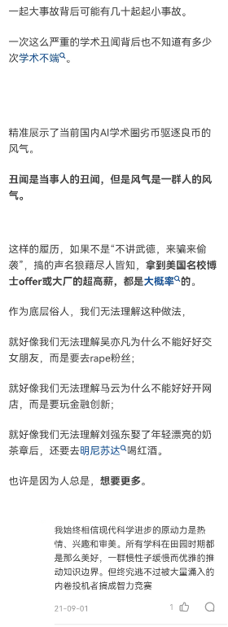

<!-- @import "[TOC]" {cmd="toc" depthFrom=1 depthTo=6 orderedList=false} -->

<!-- code_chunk_output -->

- [# 4月](#-4月)
- [18号](#18号)
- [19号](#19号)
- [22号](#22号)
- [23号](#23号)
- [30号](#30号)
- [# 5月](#-5月)
- [13号](#13号)
- [15号](#15号)
- [29号](#29号)
- [# 6月](#-6月)
- [1号](#1号)
- [22号](#22号-1)
- [# 7月](#-7月)
- [2号](#2号)
- [7号](#7号)
- [27号](#27号)
- [# 8月](#-8月)
- [2日](#2日)
- [3日](#3日)
- [7号](#7号-1)
- [14号](#14号)
- [27号](#27号-1)
- [# 9月](#-9月)
- [8号](#8号)
- [关于RM和苍穹](#关于rm和苍穹)
- [24号](#24号)
- [29号](#29号-1)
- [# 10月](#-10月)
- [7号](#7号-2)
- [16号](#16号)
- [20号](#20号)

<!-- /code_chunk_output -->

# 4月
----

## 18号

- LwIP是Light Weight (轻型)IP协议，有无操作系统的支持都可以运行。LwIP实现的重点是在保持TCP协议主要功能的基础上减少对RAM 的占用，它只需十几KB的RAM和40K左右的ROM就可以运行，这使LwIP协议栈适合在低端的嵌入式系统中使用。
- 信号与系统复习到第五章

## 19号

- 信号与系统复习到第七章

## 22号

- 英语背完unit5
- 同济高数复习到第二章
- 学习esp32有关gpio的api，初步了解了怎么使用esp-idf的api进行开发。vscode的插件编译非常慢，推荐用命令行编译。在esp-idf目录下新建项目，用vscode打开可以索引头文件。

## 23号

- ESP32在`menuconfig`中添加选项，要在组件目录或main目录下新建`Kconfig.projbuild`文件（使用kconfig语法）。直接在sdkconfig中添加选项是没有用的，使用`menuconfig`命令会重新生成该文件，覆盖原来的选项。
- 可以自己创建`sdkconfig.defaults`文件，编译的时候会首先使用其中的配置。
- BT经典蓝牙用于传输大数据量，BLE低功耗蓝牙。

## 30号
- 高数复习到第四章总习题
- 学习esp32的socket例程
- 最近一直在看px4

# 5月
----

## 13号
- 添加md笔记

## 15号
- 完成csapp bomb lab

## 29号
- 完成csapp attack lab，除最后一个phase
- 高数复习到第十一章
- 自控学到第四章

# 6月
----

## 1号
- xv6-book chapter1，视频看到lecture4
- 尝试调试xv6 内核

## 22号
- xv6-book chapter3
- 复习introduction to linear algebra
- 准备工程电控培训。阅读RM开源代码并注释，规划工程代码框架。

# 7月
----

## 2号
又到了rm赛季末招新的时候，听到有些学弟上来就问加多少分就很反感。刷B乎看到大佬论文抄袭（B乎只关注学术，没想到学术界也有浮躁的人），想到电信工学风，emo到凌晨3点。我一直坚持先做人再做事，这么多年了我也做错了很多事，每次回想起来都觉得自己很傻逼，内心敏感和精神内耗真的太难了。但是自从上了大学我发现很多人都不是这么想的。

众所周知，电信工是我工大计院学风最差的专业，保研里也有带手机作弊的，到处挂名水比赛水论文，还喜欢包装自己吹牛不知羞耻。强如清华本科，港科学硕也想走歧路。有时候想要的越多，可能离一无所有的时候就不远了。我也想要更多，但我想要的是看更多的经典教材和各领域的圣经，想尝试研究robotic方向（如果有机会的话），我还是相信学术界要比社会更加理想主义一点。我不喜欢什么“屠龙术”，大学三年看过xv6、linux0.12内核，看过px4，玩过简单的逆向工程和代码注入攻击，打过rm，我自信我的计算机水平在计科也能排在前列。这就是我理想中的大学，可以自由地去学自己想学的东西。唯一后悔的时应该多花点心在某些专业课上，因为某些老师讲得不好或者课程太无聊而不想学。可以想象我这样的人进入社会后如果不满意从事的工作会有多痛苦，那样的话只有私底下捣鼓些小玩意才能支撑下去吧。所幸我最喜欢的是robotic，其次是cs、信号和cv，所以大学三年才有机会自学。工作应该也能找到自己满意的，能养活自己和父母，偶尔吃顿好的就够了，反正爱情应该是找不到了，现在遇到心动的最多多看两眼。希望多年以后回头看时，自己还能保持初心和心底那一点理想主义，并且问心无愧。

## 7号
又是被施工吵醒的一天，早上六点四十多被吵醒，晚上十点回宿舍还在装修。前几天摆烂不是很想学习，看书看两三个小时就看不下去了。感觉我有点三分钟热度，或者说间接性踌躇满志？不知道自己适不适合做科研，做科研要耐得住寂寞。前几天想找一些关于理想主义的书，大致看了下《理想国》的评论，是讲正义和善，又大致看了下第一卷，放弃。以我的水平还是看小说好了，B乎上搜索找到毛姆的《刀锋》，图书馆最后半小时看了译者序言。发现不能一直做同一件事，考研、经典教程和敲代码要交替，不想学的时候就看会儿小说。

## 27号
两天看完了，翻译的真难受，有时间再看英文版的。我想我永远也成为不了拉里那样的人，只是个还没有放弃理想的普通人。问天实验舱对接成功了，时常后悔出生在21世纪，人类仍然在自相残杀，简直无药可救。不说星际旅行，人类至今还没有走出太阳系。如果晚出生几千年，可能我最大的理想就实现了，成为企业号那样的星舰的舰长。每当想到这里我都会暂时忘记科学，希望轮回真的存在，当然最大的可能是人类已经自我毁灭了。我不过是个智商普通的俗人，但我永远不会放弃追求真理。RM最近有个无人机仿真比赛，看看有没有机会参加，很喜欢现在的状态，可以自由地学习，不喜欢为了别的目的而读研，虽然理解都是为了生活。佛系考研，感谢互联网，考不上也有机会学习。人生已经过了快四分之一，最大的理想是不可能实现了，怎么开心怎么来吧，希望工作后还能相信精神大于物质。但还是要有一点钱的，不然想在DCS里开飞机都开不了。

# 8月
----

## 2日
22：43，美3号人物佩洛西专机准时降落台湾松山机场，看了一晚上航迹，没有任何干扰、伴飞和驱逐的痕迹。反制措施是演习，还是4号开始，后来估计是看网民压不住了，说今晚就开始。

## 3日
种种迹象看来，第四次台海危机，应该仍然是国耻，就在建军节后一天。但是舆论一片赢麻了的假象，与之前几次不同，看来是学会嘴硬了，现在都已经输不起了，以后不会再相信官媒和官方声明。近三十年有多少国耻了，不知道建国的时候有多少，想来应该没有现在多吧。战争是政治手段，别吹了这么大的牛是为了转移国内矛盾。

昨晚熬到两三点受不了睡了，八点多起床看到谴责和禁止出口，看到佩洛西称台湾为民主国家。很失望。舆论风向大变，理中客和事后诸葛亮开始痛骂开战派，估计是在转移矛盾，这手段也太拉了，格局小了，应该再试目五千年。说实话，大部分人都知道不可能打佩洛西，但是你哪怕干扰一下呢。不打，官媒就别宣传什么“埋葬一切来犯之敌”，大伙就不会这么高潮，还以为要登岛了。现在看来，别回头埋葬什么“不理智的网民”就行了。原本想着万一中美开战，甚至哪怕只是登岛，我也拼命去考哈工大进国防七子了，最多考两年考不上就去报名东部战区了。还说什么开战了键盘侠跑的最快，你敢打吗，哪怕是打台湾，你要真打了那我真敢上。现在看来，要是十年内试目完毕就谢天谢地了。00后被官媒整的一愣一愣的还好，要是当初经历过96台海危机等国耻的人也被忽悠了，那该有多难受，忍了这么多年以为可以硬起来了，结果被自己人骗了。什么时候硬气的标准这么低了。

仍然记得在高考前一个多月华为被制裁，当时每周升旗看着国旗唱着国歌，心里都在想我要搞芯片，那时候还是个纯兔兔。上了大学看的东西多了，明白了政府、国家、民族等概念，也看到还有很多很多很多不公平甚至是黑暗，但是仍然有信心去建设这个国家。逐渐转为半兔半左，没有转为神神是因为自己身上还没有什么太过分的不公。经过这次事件已经转为乐子人了，像这种国家大事也就图一乐吧，要是认真说不定就自己先进局子了。我也没有什么决心和兴趣去考公改变现状，只想去学习真理，但原本有一半原因是为中华之崛起而读书，现在只是自私的抬头仰望星空罢了。

## 7号
如果早点看到费曼访谈，我可能就去学物理了，是我的理想导师的模样。当看到自己的很多想法和对世界的看法都与费曼一致时，无法抑制内心的激动。

生活压力还是挺大的，不知道以后能赚多少钱，但是钱多钱少都有自己的活法。至于爱情，除非有人主动否则我可能会不婚不育吧。写日记还是挺爽的，放github上不会丢，而且也没人会看。

## 14号
摆烂了几天，昨天和室友去了省博物馆。最近几天心情不是很好，什么都不想干。习惯真的很可怕，原本以为初中的习惯已经忘记了，闲下来的时候才发现还在折磨我。改不了就算了，随缘吧。

## 27号
终于开学了，这饭堂要吃吐了。人是群居动物，新生的到来让校园增添了活力。焦虑的原因找到了，不管考没考上，最后都要回苍穹做平衡步兵。一放假就开始摆烂，这坏习惯要改一改，自制力越来越差了，要重新开始锻炼了，简单的跑步、练腹肌还是可以的。笔记本配置太低了，这几天仿真卡得我头疼。
重温刀剑第一季，亚丝娜yyds。虽说要爱具体的人，不要爱幻想的人，但是纸片人真香！

# 9月
----
## 8号
图啥呢，我也不知道图啥，反正不是图一乐。

## 关于RM和苍穹
copy自`embedded.md`
记得我第一次了解到RM这比赛是高考完的暑假，当时我就想，上大学一定要打这个比赛。但是我进了工带后发现我们学校没有参加这比赛，然后去找金老师问我们学校可不可以打这个比赛，没想到金老师说他们正打算组一支队伍，我就加入了。当时工带有2支队伍，计院这边叫Zero One，工培中心的创客空间也有一支队伍叫苍穹，第一年因为疫情等原因2支队伍只参加了线上单项赛。在第一年里我就跟在学长学姐后面学习，连车都摸不着，而且基本上是自学。毕竟是第一年，学长学姐们都忙着调车，而且经费不足，那时候我都不知道C板是什么。

到了第二年，2支队伍打算打超级对抗赛就合并为苍穹。当时我想得是球球了让我碰下电机吧，让我调啥都行，哪怕最后获奖的时候没写上我也无所谓。让我没想到的是学长们让我做工程的电控，那应该是我大学里最开心的时候，机械没出车的时候我就玩C板，玩电机，虚空写代码，在机械出车前我就写好工程大部分功能了，虽然是从官方C板代码魔改的。寒假后终于出车了，并且好像快到中期答辩了，所以我下课了基本就是直接去工培调车。我忍不住吐槽一下，雕刻机实在是太吵了，工培那小房间也坐不下几个人，所以大家基本上都在房间外面调，但是大厅里也不容易，切板子的时候跟沙尘暴似的。过了中期答辩后工程决定做第二版车，我只能调调老工程，优化程序，逛下论坛看看其他学校的开源。第二版工程出车有点晚，好像比赛前一两周才装配好，救援和障碍块的PID还没调好就匆忙上场了，视觉也没时间加上去。基本上比赛那几天大家都在调车修车，特别是工程，调试时间太少了，我不敢睡。打完第一场比赛，好像继电器有问题，影响到了气动，记不太清了，只记得那天晚上我几乎没有睡觉。工程组的其他人也不敢睡，但是他们帮不上忙，因为是电控的问题，我就一边调车一边催他们睡觉。我调到了早上六点吧，睡了半个多小时。结果到赛场后精神不太好，感觉差点就remake了，接线的时候短路了，直接烧了一块C板，时间不够再换一块C板了（所以不要靠通宵来解决问题，效率太低容易出错）。所以第二场比赛工程没上，工程组除了操作手就坐在场外看直播，这场面我相信很多年后还忘不掉，这也是我大三没有继续再打的原因之一:)。打完第二场就确定不能出线了，收拾完就回去睡觉了，第三场是娱乐局，大家打的挺尽兴的。打完比赛在北京到处乱逛，也没啥心情。

回来后开会大家也没说我什么，可能是觉得一个星期调车确实太难了。但是哪怕过了一年，我每次回想起来都会喷自己做的跟shit一样。做的不行就该喷，人家强队都一样喷，我们就这点成绩还这么娇贵吗，那什么时候才能出线深圳。大三的时候yyh听到我不想干了就想接手工程，当时我觉得这学弟还不错而且一心打rm，而且工程这赛季这么拉还想过来，我就把工程全交给他了，因为我希望每一个rm魔怔人都有机会去到赛场。我现在打算考完研回来接着干吧，有什么地方能帮忙的我就帮一下，我也不在乎获奖上有没有我的名字，大二的时候不在乎，现在就更不在乎了。那张奖状已经证明我来过rm，见证了这一段难忘且有意义的经历。这就够了。

最后写上我在RM和苍穹的经历是因为我觉得很多人还不了解rm到底是一个什么样的比赛，我希望苍穹就是一个纯粹的打比赛的队伍，在这里没有什么学院之分，没有小团体，没有利益纠纷，大家一起造车、调车、修车，一起甩锅争吵道歉，一起熬夜通宵。

## 24号
我不明白这算回忆、习惯，还是放不下，亦或是我就是这么贱，为什么每次报志愿的时候又想起来。准备报哈工深了，不行就二战。
最近遇到2个垃圾人，都是战队里的。麻了，不知道怎么混进来这种东西。谁要是脏了苍穹，等我考完研回来直接开喷，tmd臭傻逼。

## 29号
很喜欢看绪论，特别是看理论的发展过程，简短的历史介绍背后隐藏着为开拓科学边界付出的多少努力，失败了多少次的实验，写了多少的稿纸。如果不是为了科研和学习的读研将毫无意义，控制理论太精彩啦:)

不要向钱看，要向上看，向星海看。不要成为被重力束缚的灵魂。

# 10月
----
## 7号
当你有能力的时候要主动承担责任，否则你所在意的东西就会被别人污染。这几天让我真正明白了人至贱则无敌，三观受到巨大的冲击，这普信要是分我一半该多好。算了，我现在这样挺好的。

## 16号
系统重装，有一些经典课程的实验代码无了，悲，明天花一天时间肝吧。哈工深控制390垫底，太难啦，准备二战:)

## 20号
焯，发现b站个人简介挂着我github账号，不过应该没人闲着来看别人写日记逼逼赖赖。