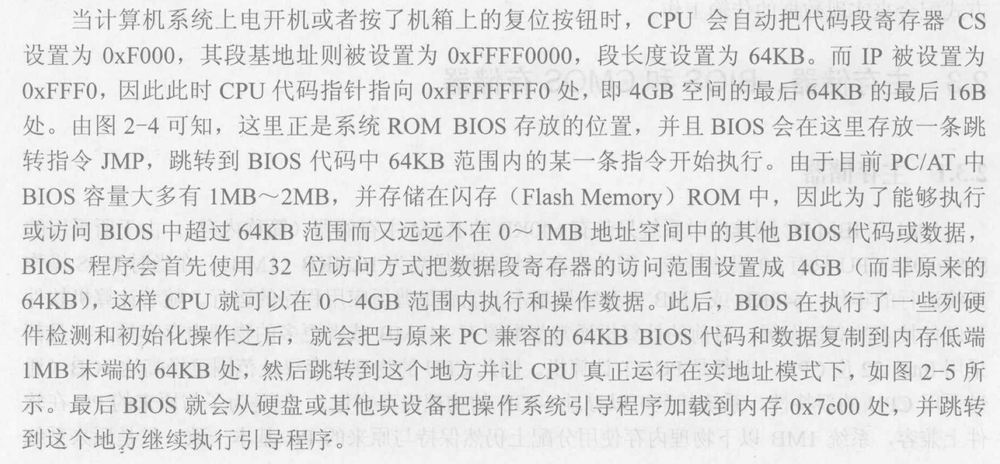

<!-- @import "[TOC]" {cmd="toc" depthFrom=1 depthTo=6 orderedList=false} -->

<!-- code_chunk_output -->

- [计算机上电后做了什么](#计算机上电后做了什么)
- [8086](#8086)

<!-- /code_chunk_output -->

## 计算机上电后做了什么
----

cpu是从内存中取指执行，上电之后RAM是空的，那么RAM中的BIOS是怎么来的。猜测是由硬件从ROM中复制过来的。

## 8086
----

- IA32体系结构
- 地址线用来寻址内存，内存和ROM/硬盘通过地址映射联系在一起，内存中的内容由操作系统的内存管理功能实现。
- 8086CPU只能工作在实模式，只能寻址1MB
- 逻辑地址和物理地址

    8086有20根地址线，却只有16位寄存器。所以把1MB内存空间分成64KB的逻辑段，用2个寄存器寻址，段基址：偏移量（也称为逻辑地址）。物理地址=段基址*16+偏移量。这种寻址方式有利于代码重定向（移动代码在内存中的位置，不需要改变偏移量）。

- SS:SP设置一个堆栈，最大容量为64KB（16位寄存器）。SP指向栈顶，堆栈向高地址生长。堆栈中的数据必须保证低字节在偶地址单元中，高字节在奇地址中。