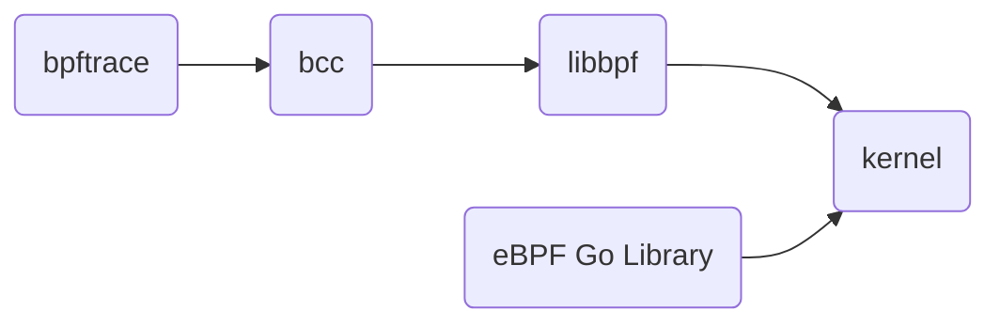

## 开放封闭原则
[https://www.cnblogs.com/gaochundong/p/open_closed_principle.html](https://www.cnblogs.com/gaochundong/p/open_closed_principle.html)

## 可变参数模板
[https://blog.csdn.net/brahmsjiang/article/details/138377789](https://blog.csdn.net/brahmsjiang/article/details/138377789)

## noexcept关键字
保证不抛出异常的函数声明为noexcept，可以编译优化

[https://www.cnblogs.com/RioTian/p/15115387.html](https://www.cnblogs.com/RioTian/p/15115387.html)

## 原子类型
从效率上来说，原子操作要比互斥量的方式效率要高。互斥量的加锁一般是针对一个代码段，而原子操作针对的一般都是一个变量

[https://juejin.cn/post/7086226046931959838](https://juejin.cn/post/7086226046931959838)

## 多线程内存序std::memory_order_relaxed
[https://blog.csdn.net/qls315/article/details/119930248](https://blog.csdn.net/qls315/article/details/119930248)

## 深拷贝和浅拷贝
深拷贝和浅拷贝是针对`引用或指针`类型，对于基本数据类型，都是简单的复制值

[https://juejin.cn/post/6844904197595332622](https://juejin.cn/post/6844904197595332622)

## 万能引用
右值引用只有发生类型推断时才是万能引用，也就是在使用模板时
```
template<typename T>
void func(T&& value)
{
    ...
}
```

## std::move
移动const对象，实际调用的是拷贝构造函数。如果拷贝构造函数被delete,编译会报错。
std::move应该用在有移动构造函数的类型中，否则和普通拷贝构造一样。

## constexpr
C++11中的constexpr指定的函数返回值和参数必须要保证是字面值，而且必须有且只有一行return代码。所以编译器在编译期间会尝试优化。

## string_view
[https://segmentfault.com/a/1190000018387368](https://segmentfault.com/a/1190000018387368)

## 构造函数的线程安全

即使构造函数的最后一行也不要泄露 this,因为 Foo 有可能是个基类。
基类先于派生类构造,执行完 Foo::Foo() 的最后一行代码还会继续执行派生类的构造函数。
这时 most-derived class 的对象还处于构造中,仍然不安全。
>如果不用二段式构造`构造函数 +initialize()`，并且在 most-derived class 的最后泄漏this是否有可能线程安全。

## 弱回调
在std::bind中绑定shared_ptr，会延长shared_ptr对象的生命期。可以使用weak_ptr，并在回调函数中lock()尝试提升。

## NXP module_fuse
[[U-Boot] [PATCH 1/4] imx: add module fuse support](https://lists.denx.de/pipermail/u-boot/2019-July/378313.html)
类似设备树？

## 惊群效应
[Linux 惊群效应之 Nginx 解决方案](https://zhuanlan.zhihu.com/p/51251700)

## docker proxy config
- daemon: /etc/docker/daemon.json
- container: ~/.docker/config.json

## ebpf

- ebpf handler参数中的ctx
    You’d find the definition for this structure in the vmlinux header file generated for the particular kernel you’re running on. The art of writing eBPF programs includes working out what structure each program receives as its context, and how to access the information within it.

- ebpf handler经常以static __always_inline开头
    That forces the compiler to put the instructions for these functions inline, because in older kernels a BPF program is not allowed to jump to a separate function. Newer kernels and versions of LLVM can support noninlined function calls, but this is a safe way to ensure the BPF verifier stays happy.
