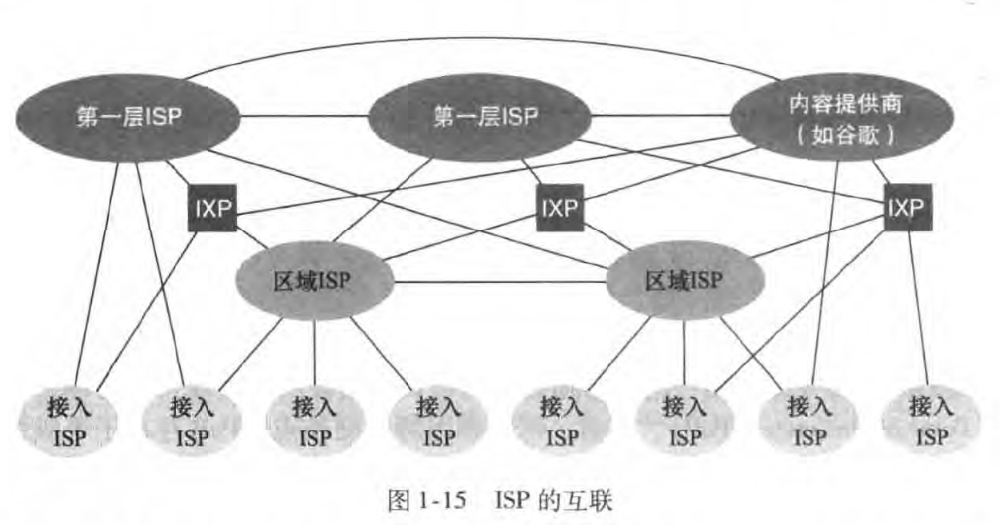
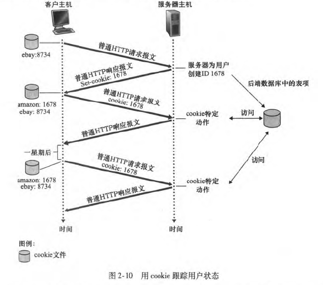
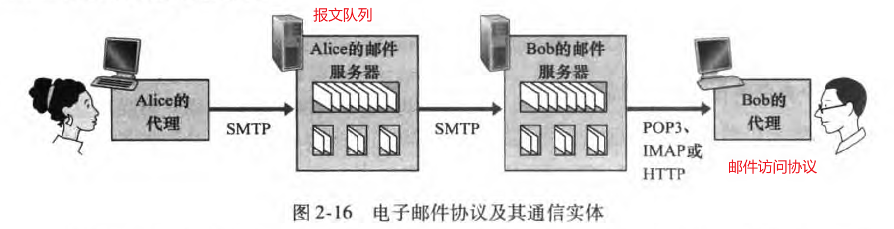
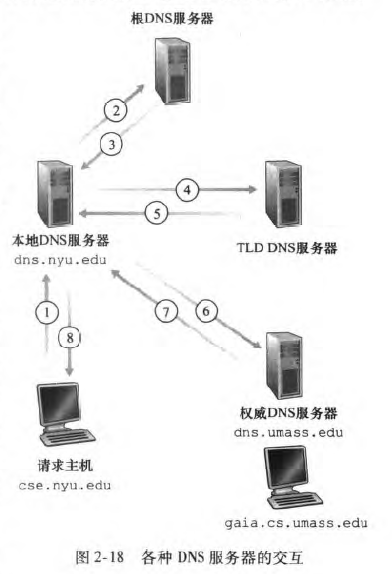

<!-- @import "[TOC]" {cmd="toc" depthFrom=1 depthTo=6 orderedList=false} -->

<!-- code_chunk_output -->

- [第1章 计算机网络和因特网](#第1章-计算机网络和因特网)
  - [1.1 什么是因特网](#11-什么是因特网)
  - [1.3 网络核心](#13-网络核心)
    - [1.3.1 分组交换](#131-分组交换)
    - [1.3.2 电路交换](#132-电路交换)
    - [1.3.3 网络的网络](#133-网络的网络)
  - [1.4 分组交换网中的时延、丢包和吞吐量](#14-分组交换网中的时延丢包和吞吐量)
  - [1.5 协议层次及其服务模型](#15-协议层次及其服务模型)
  - [1.6 面对攻击的网络](#16-面对攻击的网络)
- [第2章 应用层](#第2章-应用层)
  - [2.1 应用层协议原理](#21-应用层协议原理)
  - [2.2 Web和HTTP](#22-web和http)
  - [2.3 英特网中的电子邮件](#23-英特网中的电子邮件)
  - [2.4 DNS：因特网的目录服务](#24-dns因特网的目录服务)
  - [2.5 P2P文件分发](#25-p2p文件分发)
  - [2.6 视频流和内容分发网](#26-视频流和内容分发网)
  - [2.7 套接字编程：生成网络应用](#27-套接字编程生成网络应用)
- [第3章 运输层](#第3章-运输层)
  - [3.1 概述和运输层服务](#31-概述和运输层服务)
    - [3.1.2 因特网运输层概述](#312-因特网运输层概述)
  - [3.2 多路复用和多路分解](#32-多路复用和多路分解)
  - [3.3 无连接运输：UDP](#33-无连接运输udp)
    - [3.3.1 UDP报文段结构](#331-udp报文段结构)
  - [3.4 可靠数据传输原理](#34-可靠数据传输原理)
    - [3.4.1 构造可靠数据传输协议](#341-构造可靠数据传输协议)
    - [3.4.2 流水线可靠数据传输协议](#342-流水线可靠数据传输协议)
    - [3.4.3 回退N步](#343-回退n步)
    - [3.4.4 选择重传](#344-选择重传)
  - [3.5 面向连接的运输：TCP](#35-面向连接的运输tcp)
    - [3.5.1 TCP连接](#351-tcp连接)
    - [3.5.2 TCP报文段结构](#352-tcp报文段结构)
    - [3.5.3 往返时的估计与超时](#353-往返时的估计与超时)
    - [3.5.4 可靠数据传输](#354-可靠数据传输)
    - [3.5.5 流量控制](#355-流量控制)
    - [3.5.6 TCP连接管理](#356-tcp连接管理)
  - [3.6 拥塞控制原理](#36-拥塞控制原理)
    - [3.6.2 拥塞控制方法](#362-拥塞控制方法)
    - [3.7 TCP拥塞控制](#37-tcp拥塞控制)
    - [3.7.1 公平性](#371-公平性)
- [第7章 无线网络和移动网络](#第7章-无线网络和移动网络)
  - [WIFI——802.11](#wifi80211)
  - [蓝牙和zigbee](#蓝牙和zigbee)

<!-- /code_chunk_output -->


# 第1章 计算机网络和因特网
----
## 1.1 什么是因特网
- 分组交换机：路由器（router）和链路层交换机（link-layer switch）
- 因特网服务提供商ISP

## 1.3 网络核心
### 1.3.1 分组交换
1. 存储转发传输（store-and-forward transmission）
2. 排队时延和分组丢失：每台交换机有多条链路，每条链路都有输出缓存/队列。
3. 转发表（forwarding table）和路由选择协议（routing protocol）：前者将目的地址（或目的地址的一部分）映射为输出链路，后者用于自动设置转发表。

### 1.3.2 电路交换
- 在端系统通信回话期间，预留了端系统间沿路径通信所需的资源（缓存，链路传输速率），创建一条端到端连接（end-to-end connection），比如传统的电话网络。
-  电路交换网络中的复用：频分复用（Frequency-Division Multiplexing，FDM）和时分复用（Time-Division Multiplexing，TDM）。FDM中分为多个频段，频段的宽度成为带宽（bandwidth）。

### 1.3.3 网络的网络


## 1.4 分组交换网中的时延、丢包和吞吐量
- 节点处理时延（检查分组首部和决定该分组导向）、排队时延、传输时延（bps，和路由器之间的距离无关）和传播时延（光速，和路由器之间的距离有关）。
- 流量强度 = 比特到达队列的平均速率 / 传输速率。若大于1会一直丢包。
- 端到端时延、吞吐量。

## 1.5 协议层次及其服务模型
- 协议分层
   1. 应用层：HTTP、SMTP、FTP等，一个端系统的app与另一个端系统的app交换报文（message）。
   2. 运输层：TCP、UDP。在应用程序端点之间传送应用层报文，运输层的分组称报文段（segment）。
   3. 网络层：IP。将数据报（datagram）的网络层分组从一台主机移动到另一台主机。
   4. 链路层：以太网、WIFI等。分组称为帧（frame）
   5. 物理层：移动比特。
- 封装：分组 = 首部 + 有效载荷（通常是上一层的分组）

## 1.6 面对攻击的网络
- 恶意软件（malware）、僵尸网络（botnet）、自我复制（self-replicating）、病毒（virus需要某种形势的用户交互来感染用户设备的恶意软件）、蠕虫（worm不需要交互）。
- DOS拒绝服务攻击（Denial-of-Service attack）、DDOS分布式。
  1. 弱点攻击
  2. 带宽洪泛：发送大量分组来阻塞服务器。
  3. 连接洪泛：创建大量TCP连接来阻塞服务器。
- 分组嗅探器（packet sniffer）
- IP哄骗（虚假源地址）


# 第2章 应用层
## 2.1 应用层协议原理
- 客户-服务器体系结构（数据中心）、P2P体系结构。
- 套接字接口：进程与计算机网络之间的接口
- TCP：面向连接、可靠数据传输、拥塞控制。
> 安全套接字层（Secure Socket Layery，SSL)，加强后的TCP，提供进程到进程的安全性服务，包括加密、数据完整性和端点鉴别。应用层和运输层之间。
- UDP：仅提供最小服务。

## 2.2 Web和HTTP
- Web的应用层协议是HTTP（HyperText Transfer Protocol）超文本传输协议，它是Web的核心，客户端-服务器体系结构，流行的服务器有Apache和Microsoft Internent Information Server。
- Web页面由对象（html文件、jpeg图形、java小程序等）组成，多数Web页面有一个HTML基本文件，通过URL路径（主机名+路径名）访问其他对象。
- HTTP的运输层协议是TCP，HTTP是无状态协议（stateless protocol），服器不保存客户的任何信息。
- 持续连接（persistent connection）和非持续连接（non-persistent connection）。
- HTTP与客户如何解释一个Web页面毫无关系，由浏览器负责。用户可以配置浏览器的并行连接数。


- 用户与服务器的交互：cookie
  1. HTTP响应报文中的一个cookie首部行
  2. HTTP请求报文中的一个cookie首部行
  3. 在用户端系统中保留一个cookie文件
  4. Web站点的一个后端数据库

- Web缓存器（Web cache）也叫代理服务器（proxy server）

## 2.3 英特网中的电子邮件
- 用户代理（user agent）、邮件服务器（mail server）和简单邮件传输服务（Simple Mail Transfer Protocol，SMTP）。用户在邮件服务器上有一个邮箱（mailbox），邮件服务器用用户名和口令来识别用户。邮件发送过程：发送方用户代理 -> 发送方邮件服务器 -> 接收方邮件服务器 -> 接收方用户代理。使用TCP运输层协议。
- SMTP一般不适用中间邮件服务器，发送方服务器和接收方服务器直接相连。

- HTTP对比SMTP：
  1. HTTP是一个拉协议（pull protocol），SMTP是一个推协议（push protocol）。
  2. SMTP要求每个报文使用7bit ASCII码格式（历史原因），否则需要编码。
  3. HTTP每个对象有单独的响应报文，SMTP把所有对象放在一个报文。
- 基于Web的电子邮件：用户代理就是浏览器，和邮件服务器之间使用HTTP通信。

## 2.4 DNS：因特网的目录服务
- DNS（Domain Name System）域名系统：一个由分层的DNS服务器实现的分布式数据库，一个使主机能够查询分布式数据库的应用层协议。DNS通常由其他应用层协议使用，客户端-服务器体系结构。提供的一些重要服务：
  1. 主机名到IP地址转换的目录服务。使用UDP运输层协议。
  2. 主机别名
  3. 邮件服务器别名
  4. 负载分配：繁忙的站点被冗余地分配在多台服务器上（因此有多个IP地址），一个规范主机名与一个IP地址集合联系。当用户发出同一个DNS请求时，用整个集合轮流响应。
  >DNS是因特网上使用分布式数据库的精彩范例。
- DNS服务器的层次结构（由高到低）：根DNS服务器、顶级域（DNS）服务器、权威DNS服务器。还有每个ISP都有一个本地DNS服务器，通常起到代理作用（即转发请求）。根DNS服务器提供TLD DNS服务器的IP，TLD DNS服务器提供一些中间DNS服务器的IP，中间DNS服务器向本地DNS服务器返回权威DNS服务器IP。

- DNS缓存：除了少数DNS查询外，根服务器都被绕过了。

## 2.5 P2P文件分发
- 洪流（torrent）：参与一个特定文件分发的所有对等方的集合，对等方彼此下载等长度的文件块。每个洪流有一个跟踪器（tracker），对等方在跟踪器中注册并周期性的通知仍在洪流中。
- 最稀缺优先：均衡每个块在洪流中的数量。

## 2.6 视频流和内容分发网
- DASH（Dynamic Adaptive Streaming over HTTP）经HTTP的动态适应性流。每个视频文件有多个分辨率版本，每次传输特定时间，动态调整视频质量。
- CDN（Content Distribution Network）内容分发网

## 2.7 套接字编程：生成网络应用
```
UDPServer:
serverSocket = socket(AF_INET, SOCK_DGRAM)
serverSocket.bind(('', serverPort))
while TRUE:
    msg, clientAddr = serverSocket.recvfrom(num)
    serverSocket.sendto(msg.encode(), clientAddr)

UDPClient:
clientSocket = socket(AF_INET, SOCK_DGRAM)
clientSockek.sento(msg.encode(), (serverName, serverPort))
msg, serverAddr = clientSocket.recvfrom(num)
clientSocket.close()

TCPServer:
serverSocket = socket(AF_INET, SOCK_STREAM)
serverSocket.bind(('', serverPort))
serverSocket.listen(1)
while TRUE:
    connectionSocket, clientAddr = serverSocket.accept()
    msg = connectionSocket.recv(num).decode()
    connectionSocket.send(msg.encode())
    connectionSocket.close()

TCPClient:
clientSocket = socket(AF_INET, SOCK_STREAM)
clientSocket.connect((serverName, serverPort))
clientSocket.send(msg.encode())
clientSocket.recv(num)
clientSocket.close()
```


# 第3章 运输层
## 3.1 概述和运输层服务
### 3.1.2 因特网运输层概述
- IP网际协议的服务模型是尽力而为交付服务（best-effort delivery service），不保证报文段的按序交付，不保证报文段中数据的完整性。每台主机有一个IP地址。
- 运输层的多路复用（transport-layer multiplexing）和多路分解（demultiplexing）：将主机间的交付拓展到进程间交付。
- 进程到进程的数据交付和差错检查是2种最低限度的运输层服务，也是UDP所能提供的仅有的2种服务。但是UDP和IP都是不可靠服务，不能保证数据能完整无缺地全部到达目的地。

## 3.2 多路复用和多路分解
- 1个进程有1个或多个套接字，套接字连接应用层和运输层，每个套接字都有唯一的标识符，标识符的格式取决于使用UDP还是TCP。 
- 端口号为16bit，0-65535，周知端口号：0-1023。
- 无连接的多路复用和多路分解：`socket()`方法自动分配一个端口号，然后调用`bind()`绑定指定的端口号。一个UDP套接字由一个二元组（目的IP和目的端口号）全面标识。
- 面向连接的多路复用和多路分解：TCP套接字由一个四元组（源IP，源端口号，目的IP，目的端口号）来标识。
  >使用nmap进行端口扫描

## 3.3 无连接运输：UDP
- 使用UDP的应用可以在应用程序自身中建立可靠性机制，如谷歌chrome的QUIC协议。
### 3.3.1 UDP报文段结构
- 长度包含首部和数据，单位字节。

- 端到端原则（end-end principle）：与在较高级别提供这些功能的代价相比，在较低级别上设置的功能可能是冗余的或几乎没有价值的。

## 3.4 可靠数据传输原理
### 3.4.1 构造可靠数据传输协议
- 有限状态机（Finite-State Machine，FSM）。
- 自动重传请求（Automatic Repeat reQuest，ARQ）协议：
  - 差错检测。
  - 接收方反馈（ACK和NAK）。
  - 重传：丢包或接收方收到有差错的分组时，发送方重传。但是会在信道中引入冗余分组（duplicate package），即接收方无法分辨重传还是新数据。
- 停等（stop-and-wait）协议：发送方接收到ACK后才发送下一分组。
- 为了解决冗余分组，添加序号（sequence number）新字段。在停等协议中最少只用1bit序号就可以解决重传。
- 发送方负责检测和恢复丢包工作：需要一个倒计数定时器（countdown timer），使用重传机制来恢复丢包。

### 3.4.2 流水线可靠数据传输协议
- 停等协议有非常低的发送方利用率，所以允许发送方发送多个分组而无须等待确认：
  - 增加序号范围。
  - 发送方和接收方要缓存多个分组。
  - 流水线的2种差错恢复方法：回退N步（Go-Back-N，GBN）和选择重传（Selective Repeat，SR)

### 3.4.3 回退N步
- 也被称为滑动窗口（sliding-window protocol）协议，N称为窗口长度（window size），流量控制是限制窗口长度的原因之一。
  >TCP中的序号按字节流中的字节计数，而不是按分组。

  

- 累积确认（cumulativ acknowledgement）：ACK是已发送且被正确接收的序号，表明接收方已正确接收到序号为n及之前的所有分组。
- 超时事件：发送方重传所有已发送但未被确认的分组，只有一个定时器。
- 非按序到达的分组都被丢失，所以接收方只需要维护下一个分组的序号，接收方不需要缓存。

### 3.4.4 选择重传
- 发送方仅重传它怀疑在接收方出错（丢失或受损）的分组而避免不必要的重传，每个分组都有自己的逻辑定时器，可以用一个硬件定时器模拟多个逻辑定时器。
- 接收方缓存失序的分组直到基序号分组被收到，然后将接收到的基序号开始的连续分组交付上层。

  >窗口长度必须小于或等于序号空间大小的一半。
- 确保一个序号不被重新使用，发送方假定分组在网络中的最长存活时间（大约3分钟）。
- ACK是已发送且被正确接收的序号。

## 3.5 面向连接的运输：TCP
### 3.5.1 TCP连接
- 三次握手（three-way handshake）期间会设置发送缓存，TCP从缓存中取出放入报文段的数据量受限于最大报文段长度（Maximum Segment Size，MSS）。MSS根据最大链路层帧长度，即最大传输单元（Maximumm Transmission Unit，MTU）设置，MSS保证一个TCP报文段 + TCP/IP首部长度（通常40字节） = MTU。
  >以太网和PPP链路层协议的MTU为1500字节，所以MSS的典型值为1460字节。

### 3.5.2 TCP报文段结构
- TCP首部一般是20字节：
  - 序号和确认号字段：用于可靠数据传输服务。
  - 接收窗口字段：用于流量控制，指示接收方愿意接收的字节数量。
  - 首部长度字段：以32bit（字）为单位的TCP首部长度（可变，通常选项字段为空，典型长度为20字节）。
  - 选项字段：用于发送方和接收方协商MSS，或在高速网络环境下用作窗口调节因子等。
  - 标志字段

- 累积确认，确认号ACK同时用于下次希望接收的序号，这种确认称为被捎带（piggybacked）在服务器到客户的数据报文段中。对于失序报文段由实现TCP的程序员实现。ACK是下一次发送的分组序号。

### 3.5.3 往返时的估计与超时
- 报文段的样本RTT（SampleRTT）：大多数TCP的实现仅在某时刻对一个已发送但未确认的报文段估计SampleRTT。
- TCP维持一个SampleRTT的均值EstimatedRTT
  EstimatedRTT = 0.875 * EstimatedRTT + 0.125 * SampleRTT

### 3.5.4 可靠数据传输
- TCP只有一个定时器，采用累积确认。
- TCP发送方使用了流水线。
- 超时间隔加倍。
- 快速重传（fast retransmit）：TCP不适用NAK，当接收方发生丢包或失序时，发送一个冗余ACK（即重发上一个ACK）。发送方接收到3个冗余ACK后执行快速重传。
- 回退N步还是选择重传：TCP发送方只需要维护已发送过但未被确认的最小序（SendBase）和下一个要发送的字节的序号（NextSeqNum），是GBN协议和SR协议的混合体。和GBN的区别是缓存失序报文段，和SR的区别是快速重传。

### 3.5.5 流量控制
- 流量控制服务（flow-control service）：发送方和接收方的速率匹配。发送方维护一个接收窗口（receive window）的变量。
  >UDP没有流量控制服务，接收方可能会缓存溢出。
- 拥塞控制（congest control）：TCP发送方因为IP网络的拥塞而被抑制。

### 3.5.6 TCP连接管理
- TCP三次握手期间容易受到称为SYN洪泛的拒绝服务攻击，攻击者发送大量的TCP SYN报文段，而不完成第三次握手（服务器会等待一分多钟后回收资源），服务器会不断为这些半开连接分配资源。防御手段是SYN cookie。


- 如果TCP服务器端口没有打开，会返回一个特殊重置报文段，RST标志位置1。
  如果UDP服务器端口没有打开，会返回一个特殊的ICMP数据报。

## 3.6 拥塞控制原理
- 丢包一般是路由器缓存溢出。

### 3.6.2 拥塞控制方法
- 端到端拥塞控制：网络层不为运输层拥塞控制提供显示支持。TCP采用该方法，通过超时或3次冗余ACK判断网络拥塞（即丢包）。
- 网络辅助的拥塞控制：最近IP和TCP也能选择性使用。明确拥塞通告（Explicit Congestio Notification，ECN）。

### 3.7 TCP拥塞控制
- 发送方维护一个拥塞窗口（congestion window，cwnd）的变量。
- 慢启动：cwnd=1个MSS启动，每个首次ACK将cwnd加一（每过一个RTT，发送速率翻倍，指数增长）。
  1. 超时：cwnd = 1，ssthresh慢启动阈值 = cwnd/2，重新慢启动。
  2. 超时：ssthresh = cwnd，重新慢启动且当cwnd > ssthresh进入拥塞避免。
  3. 3次冗余ACK：快速重传并进入快速恢复。
  >TCP分岔：优化搜索、电子邮件和社交网络等云服务。

- 拥塞避免：每个RTT将cwnd加一，发送速率线性增长。
  1.  超时：cwnd = 1，ssthresh = cwnd/2，进入慢启动。
  2.  3次冗余ACK：cwnd/2，ssthresh = cwnd/2。快速重传并进入快速恢复

- 快速恢复（非必须）：cwnd + 3 * MSS，当接收到丢失报文段的ACK时，降低cwnd后进入拥塞控制。丢包时与超时情况1一样。

- 也称为加性增，乘性减（Addtive-Increase，Multiplicative-Decrease，AIMD）拥塞控制方式。

### 3.7.1 公平性
- 现实世界中具有较小RTT的连接在链路空闲时能更快抢到可用带宽，并且应用程序可以使用并行RTT，可能破坏公平性。


# 第7章 无线网络和移动网络
----

## WIFI——802.11
- 基本服务集BSS、服务集标识符SSID、信标帧（beacon frame）
- 接入点AP、站点STATION
- CSMA/CA（带碰撞避免的载波监听多路访问）协议
- 11个信道，同一物理网络下2个ap之间至少间隔4个信道才不会干扰。

## 蓝牙和zigbee
- 蓝牙：低功率、小范围、低速率。超过每秒兆比特的数据率。
- zigbee：低功率、低数据率、低工作周期。