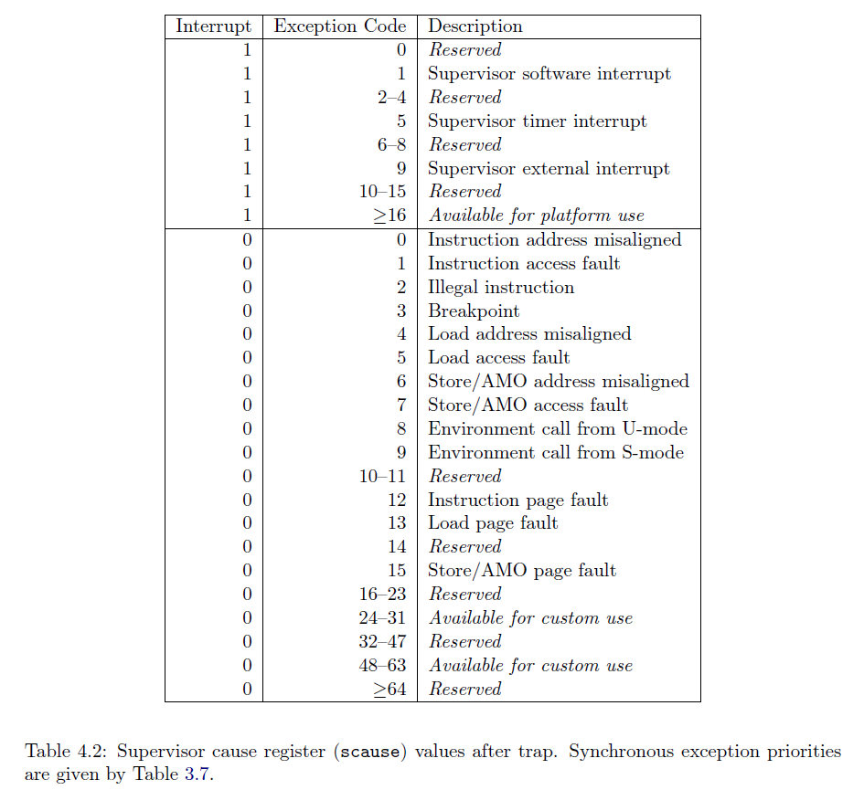

<!-- @import "[TOC]" {cmd="toc" depthFrom=1 depthTo=6 orderedList=false} -->

<!-- code_chunk_output -->

- [简介](#简介)
- [xv6-book](#xv6-book)
  - [Chapter1 Operating system interfaces](#chapter1-operating-system-interfaces)
    - [1.1 Processes and memory](#11-processes-and-memory)
    - [1.2 I/O and File descriptors](#12-io-and-file-descriptors)
    - [1.3 Pipes](#13-pipes)
    - [1.4 File system](#14-file-system)
    - [1.5 Real world](#15-real-world)
  - [Chapter2 Operating system organization](#chapter2-operating-system-organization)
    - [2.2 User mode,supervisor mode,and system calls](#22-user-modesupervisor-modeand-system-calls)
    - [2.3 Kernel organization](#23-kernel-organization)
    - [2.5 Process overview](#25-process-overview)
    - [2.6 Code: starting xv6, the first process and system call](#26-code-starting-xv6-the-first-process-and-system-call)
    - [2.7 Security Model](#27-security-model)
  - [Chapter3 Page tables](#chapter3-page-tables)
    - [3.1 Paging hardware](#31-paging-hardware)
    - [3.2 Kernel address space](#32-kernel-address-space)
    - [3.3 Code: create an address space](#33-code-create-an-address-space)
    - [3.5 Code: Physical memory allocator](#35-code-physical-memory-allocator)
    - [3.7 Code: sbrk](#37-code-sbrk)
    - [3.8 Code：exec](#38-codeexec)
  - [Chapter4 Traps and system calls](#chapter4-traps-and-system-calls)
    - [4.1 RISC-V trap machinery](#41-risc-v-trap-machinery)
    - [4.2 Traps from user space](#42-traps-from-user-space)
    - [4.3 Code: Calling system calls](#43-code-calling-system-calls)
    - [4.4 Code: System call arguments](#44-code-system-call-arguments)
    - [4.5 Trap from kernel space](#45-trap-from-kernel-space)
    - [4.6 Page-fault exceptions](#46-page-fault-exceptions)
    - [4.7 Real world](#47-real-world)
  - [Chapter5 Interrupts and device drivers](#chapter5-interrupts-and-device-drivers)
    - [5.1 Code:Console input](#51-codeconsole-input)
    - [5.2 Code: Console output](#52-code-console-output)
    - [5.3 Concurrency in drivers](#53-concurrency-in-drivers)
    - [5.4 Timer interrupt](#54-timer-interrupt)
    - [Real world](#real-world)
- [lec](#lec)
  - [lec4：Page tables](#lec4page-tables)
  - [lec5：GDB,calling conventions and stack frames RISC-V](#lec5gdbcalling-conventions-and-stack-frames-risc-v)
  - [lec6：Isolation \& system call entry/exit](#lec6isolation--system-call-entryexit)
  - [lec7：Page faults](#lec7page-faults)
  - [lec8：Q\&A for (Page table)Labs](#lec8qa-for-page-tablelabs)
- [lab](#lab)
  - [lab guidance](#lab-guidance)
  - [Lab 1: Xv6 and Unix utilities](#lab-1-xv6-and-unix-utilities)
    - [prime](#prime)
  - [Lab 2: system calls](#lab-2-system-calls)
  - [Lab 3: Page tables](#lab-3-page-tables)
  - [Lab 4: Traps](#lab-4-traps)
  - [Lab 5: Copy-on-Write Fork for xv6](#lab-5-copy-on-write-fork-for-xv6)

<!-- /code_chunk_output -->


# 简介
----
- 环境：ubuntu20.04、qemu（模拟RISC-V64）、gdb-multiarch。
- 在RISC-V中，寄存器x0永远是0。
- 在xv6中，所有的用户都是root。
- 编译器可能会优化机器指令，所以要结合kernel.asm和函数对应的*.s文件。


# xv6-book
----


## Chapter1 Operating system interfaces
- 当用户程序调用一个system call，硬件提高特权等级（privilege level），并运行内核中的一段预先安排的代码。
  >用户空间和内核空间的接口：system calls系统调用，`Look and behave like function calls, but they aren’t`。

### 1.1 Processes and memory
- 内核为每个进程维护一个PID标识符

- `exec`不会返回，会从elf header中的entry开始执行。

- `fork`和`exec`分成2个系统调用，shell利用这种分离来实现I/O重定向，而不用破坏父进程的I/O。

- 为了避免`fork`新建一个副本进程然后马上运行exec替换内存，内核用虚拟内存技术（`copy-on-write`写时复制）优化了`fork`。

- 程序在运行时可能需要更多内存（如`malloc`），可以调用`sbrk(n)`来增长n字节，返回新内存的位置。

### 1.2 I/O and File descriptors
- 每个进程都有用来存放fd的私有空间file table，fd从0开始。每个fd都有对应的offset，每次调用`read`或`write`都会从上一次地方开始。新分配的fd从最小的数字开始。

- `exec`system call会用调用的可执行文件（存储在文件系统中）覆盖进程的内存，但是会保留file table。

### 1.3 Pipes
- 对pipe进行`read`，会等待数据写入pipe，或者所有引用write end的fd关闭才会停止`read`（此时返回0）。pipe在内核中实现，有缓冲区。


### 1.4 File system
- `mknod`创建特殊文件（称为device设备），需要传入2个数字用于唯一标识一个kernel device。当打开一个device file，内核会把`read`和`write`替换为kernel device implementation，而不是把它们传递到文件系统。

- 每个inode由一个独一无二的inode number定义。当一个文件的`link`为0且没有fd引用它时，释放文件的inode和磁盘空间。

### 1.5 Real world
- xv6中都是root用户


## Chapter2 Operating system organization
- os需要满足3个需求：multiplexing，isolation and interaction。

### 2.2 User mode,supervisor mode,and system calls
- 对物理资源的抽象：进程、文件等。通过系统调用（ecall）从用户空间陷入内核空间（即从user mode转入supervisor mode）。

- riscv的3种模式：machine mode，supervisor（kernel） mode and user mode。machine mode有全部特权，supervisor mode下可以执行`privileged instructions`，比如使能/失能中断、读/写satp寄存器。
  >运行在内核空间（或运行在supervisor mode）的software/code称为kernel。

### 2.3 Kernel organization
- 宏内核（monolithic kernel）和微内核（micro kernel）。微内核中，在用户空间像进程一样运行的os服务（如file server）称为servers。

### 2.5 Process overview
- 进程的虚拟内存空间layout：

heap堆在需要时通过malloc分配空间。在虚拟地址空间最顶处分配了一页trampoline（包含进出内核的代码）和一页trapframe（save/restore用户进程的状态）。
  >硬件使用39位寻址va，但是xv6只使用了38位，避免对设置了高位的va进行符号拓展。所以最大地址`MAXVA`（kernel/riscv.h:363）= 2^38-1 = 0x3fffffffff。

- 内核为每个进程维护一个`struct proc`（kernel/proc.h:86），保存进程状态，如p->state和p->pagetable。

- 每个进程有两个栈：user stack和kernel stack，分别在用户空间和内核空间下使用。`ecall`指令进入内核空间（pc切换到内核入口点，并切换内核栈和执行内核指令完成系统调用），`sret`指令返回用户空间并切换用户栈。

- xv6中，一个进程包含一个线程和一个地址空间。

### 2.6 Code: starting xv6, the first process and system call
1. powers on：初始化，运行存储在read-only memory中的boot loader。boot loader会把xv6 kernel加载到内存中（0x80000000，因为0x0:0x80000000是I/O设备）。然后xv6以machine mode运行`_entry`（kernel/entry.S:7）。此时paging hardware失能，虚拟地址直接映射到物理地址。

2. entry.S：设置一个栈使xv6可以运行C代码（在`start.c`（kernel/start.c:11）中定义了空间stack0作为初始化栈），`_entry`处代码把地址stack0+4096（栈顶，RISC-V的栈向下增长）加载到栈指针`sp`。然后跳转进入`start()`（kernel/start.c:21）。

3. start.c：进行一些只能在machine mode运行的初始化并转到supervisor mode。通过`mret`指令返回supervisor mode（`mret`指令通常用于从supervisor mode跳转到machine mode后的返回，这里设置`mstatus`的previous privilege mode为supervisor mode，设置`mepc`为main函数地址作为返回地址，设置`satp`寄存器为0来失能内存地址映射，把所有中断和异常委托给supervisor mode），同时编程时钟芯片来初始化定时器中断。上述操作将导致pc寄存器指向`main()`（kernel/main.c:11）。

4. main.c：初始化一些设备和子系统后，运行`userinit()`（kernel/proc.c:226）即创建第一个进程等待scheduler调度，该进程是`initcode.S`（user/initcode.S:3）的RISC-V汇编代码，作用是`exec(init, argv)`。首先将`exec`需要的参数加载到寄存器`a0`（"/init\0"）和`a1`（argv）中并把系统调用编号`SYS_EXEC`(kernel/syscall.h:8)加载到寄存器`a7`中，然后调用`ecall`重新进入内核执行系统调用`exec`运行`/init`（user/init.c:15）。
    >kernel在`syscall`（kernel/syscall.c:133）中使用寄存器`a7`中的整数执行对应系统调用。
    系统调用表（kernel/syscall.c:108）把`SYS_EXEC`映射为`sys_exec`。
    在`proc.c`中的`uchar initcode[]`就是`initcode.S`的十六进制代码。

### 2.7 Security Model 
- security：os必须假设进程的user-level代码会尽最大的可能去破坏内核或其他进程。在内核中可能存在bugs的地方设计safeguards，如：assertions、type checking和stack guard pages。


## Chapter3 Page tables
- xv6的一些tricks：将同样的一段内存（trampoline page）映射到不同地址空间中，同时内核栈和用户栈后都有未映射的一页来保护栈。

### 3.1 Paging hardware
- RISC-V内核和用户空间的指令操纵的地址都是虚拟地址，但是RAM（物理内存）由物理地址索引。

- 页表映射过程：在Sv39 RISC-V中，只使用了64位虚拟地址中只有低39位用于地址映射（共512GB），高25位用于未来拓展。在39位中，前27位用于3级页表，所以页表就是一个存储2^27项PTEs的数组，每个PTE有44位physical page number（PPN）和一些flag（多余的位用于拓展）。后12位为物理内存offset，用于索引一页（2^12 = 4096字节）中的偏移。每级页表有512项，索引下一级页表时，offset全为0。
最后一级页表的44位PPN和虚拟地址中的最后12位offset组成56位物理地址（2^56字节），用来寻址I/O设备和DRAM。


- 如果只使用一级页表，需要2^27表项，需要占用很大的空间。如果一个进程用不到全部页表，多余的页表项（第2、3级页表）不会分配空间。

- 如果虚拟地址translate过程中有地址不在页表中会引发page-fault异常，由内核处理。

- 为了避免从物理内存移动PTEs的代价，RSIC-V CPU使用TLB(Translation Look-aside Buffer)用于缓存PTEs。

- 需要把根页表的物理地址放到`satp`寄存器中来通知硬件使用页表，每个CPU有自己的`satp`。
  页表存在内存中的某个位置。MMU根据`satp`查找页表，MMU不负责建立页表，而是os负责。如果需要的物理地址（PM）不在页表中，MMU引发page-fault异常，由os负责从磁盘中寻找需要的page并移动到物理内存中。

- 物理内存指的是DRAM中的存储单元，每个字节都有一个地址，称为物理地址。os初始化开启地址映射后，指令使用的地址是虚拟地址。

### 3.2 Kernel address space
- kernel address map

  xv6为每个进程维护一张pagetable，同时为内核维护一张kernel pagetable（直接映射）。

  有2个地址没有直接映射：
  1. trampoline page：映射2次，1次虚拟地址顶部，1次直接映射。
  2. kernel stack page：每个进程都有自己的kstack，伴随一页guard page（不设置PTE_V），内核在内核栈中溢出会引发异常同时内核会panic。guard page不会在物理地址中映射空间。
  >如果kstack采用直接映射方式，guard page对应的物理地址将很难使用。 
  
### 3.3 Code: create an address space
在`main()`（kernel/main.c）中初始化地址映射。

1. `kinit()`：擦除从end到PHYSTOP的物理内存，并在每个free page开头写入struct run，指向kmem.freelist，即指向下一页free page。

2. `kvminit()`：创建PTE和proc stack，核心函数为`mappages()`（kernel/vm.c:138）和`walk()`（kernel/vm.c:81）。`walk()`用于寻找或创建pte。创建了`NPROC`（最多进程数）个proc stack（大小为一页）。
    >PA2PTE：先右移12位清除offset，再左移10位为Flags预留位置。
    PTE2PA：先右移10位清除Flags，再左移12位为offset预留位置。
    copyout()和copyin()也在kernel/vm.c中，因为它们需要翻译va到pa。

3. `kvminithart()`：kernal pagetable写入satp
寄存器并enable paging。

4. 当改变页表时，需要invalid目前缓存的TLB entries，指令`sfence.vma`会刷新目前CPU的TLB。xv6在kvminithart()中加载`satp`寄存器和在trampoline code（切换用户页表before返回用户空间）中执行`sfence.vma`。

### 3.5 Code: Physical memory allocator
- 每个free page除了`struct run`之外不存储任何其他内容。freelist被一个`spin lock`保护，list和lock放在一个结构体中（`kmem`）。

- kinit()中初始化allocator，即初始化从`end of kernel`到`PHYSTOP`的物理内存到freelist。一个PTE只能对应以4096字节对齐的一段物理内存，所以初始化页表时传入的va和pa都是以4096字节对齐。

### 3.7 Code: sbrk
- xv6使用系统调用`sbrk`来缩小或增长进程内存，通过函数`growproc()`（kernel/proc.c:253）调用`uvmalloc()`和`uvmdealloc()`。`uvmalloc()`（kernel/vm.c:221）调用`kalloc()`分配物理内存和`mappages()`添加PTEs到用户页表。`uvmdealloc()`（kernel/vm.c:166）调用`uvmunmap()`（调用`walk()`查找PTEs）和`kfree()`释放物理内存。

### 3.8 Code：exec
- `exec`（kernel/exec.c:13）系统调用使用文件系统里的一个`elf`文件（kernel/elf.h）来初始化一个地址空间的用户部分。
  1. namei()：根据`path`获取文件inode，每个文件都由唯一的inode标识。
  2. readi()：读取文件，判断是否为`elf`文件。
  3. proc_pagetable()：创建一张没有映射的用户页表（没有user memory，有trampoline pages）。
  4. 调用`uvmalloc()`（kernel/exec.c:52）为每个elf段分配内存并建立页表映射，调用`loadseg()`（kernel/exec.c:10）加载每个段到内存中（使用`walkaddr()`查找要分配的pa）。
      >filesz可能小于memsz。
  5. 分配并初始化一页用户栈以及一页guard page。调用`copyout()`把argv参数入栈，最后放入一个空指针。前三个参数分别为：假pc，argc指针和argv指针。guard page除了检测栈溢出，还可以检测参数过长。
  6. 初始化新进程`proc`结构体相关成员，释放旧进程的页表。
  7. 以上过程发生错误则释放新建的页表，然后`exit(-1)`返回旧进程。只有到最后一步才释放旧进程的页表，否则exit出错。
  >elf文件中的地址或指令可能指向内核，所以需要做一系列的检查，防止破坏内核和用户空间的隔离。

- xv6内核缺少`malloc()`类似的allocator/动态内存分配器。 


## Chapter4 Traps and system calls
- 当发生`system call`,`exception`,`interrupt`时（统称为`trap`陷阱）CPU暂停当前指令，并转到解决上述事件的特殊代码中。内核可以只通过`a single code path`来解决所有的代码路径，然后判断3种情况执行对应代码（通常称为`handler`）。第一条`handler`指令通常是汇编，称为`vector`。

### 4.1 RISC-V trap machinery
- `stvec`：保存trap handler地址。
  `sepc`：trap发生时保存当前`pc`，执行`sret`指令返回时会将该寄存器的值放进`pc`中。
  `scause`：保存表明trap发生原因的整数。
  `sscratch`：在trap handler开始时会指向p->trapframe。
  `sstatus`：其中SIE位表示是否开启设备中断，SPP位表示trap发生的mode。
  上述寄存器在supervisor mode下才能读写，每个CPU都有这些寄存器。traps handled in machine mode有一套类似的寄存器，只有定时器中断才会使用。

- trap发生时硬件做的事（除了定时器中断）：
  1. 如果是设备中断，且`sstatus`SIE位清零，不做以下动作。
  2. `sstatus`的SIE位清零来失能中断。
  3. 复制`pc`到`sepc`。
  4. 保存当前模式（user or supervisor）到`sstatus`SPP位。
  5. 设置`scause`。
  6. 设置supervisor mode。
  7. 复制`stvec`到`pc`。
  8. 到新的`pc`处执行。
  注意CPU不切换内核页表、内核栈，不保存除了`pc`之外的寄存器，由内核完成。

### 4.2 Traps from user space
- 发生陷阱时硬件不会切换页表，当发生陷阱时，内核设置相关寄存器，然后进程切换`supervisor mode`运行`trampoline`（kernel/trampoline.S:16），其中的`uservec()`就是trap handler函数，此时仍然是用户页表，在该函数中切换内核页表。所以`trampoline`被映射到用户页表和内核页表的相同位置（va最高处）。

- 当`uservec()`开始运行时，需要保存32个寄存器的值到内存中，所以需要一个寄存器保存该内存地址。`csrrw`指令交换`a0`和`sscratch`（进入用户空间前，内核设置指向`p->trapframe`）的内容。然后在`trapframe`中保存寄存器包括`a0`（读取自`sscratch`）的值。

- 每个进程的`trapframe`中包含当前进程的内核栈地址，当前CPU的hartid，`usertrap()`地址，内核页表地址。`uservec()`取回这些值，设置`satp`来切换内核页表，然后调用`usertrap()`。

- 处理流程：
  1. 内核设置相关寄存器：`stvec`（指向`uservec()`）,`sepc`,`scause`,`sscratch`,`sstatus`。
  2. `uservec()`（kernel/trampoline.S:16）：保存32个通用寄存器到`p->trapframe`。从`p->trapframe`加载内核相关寄存器，此时切换到内核页表。跳转到`usertrap()`并且不会返回。
  3. `usertrap()`（kernel/trap.c:37）：在`stvec`寄存器存入`kernelvec()`（kernelvec.S）的地址（以便中断和异常使用）。保存`sepc`的值到`p->trapframe->epc`，因为后面可能要调用`yield()`来切换进程（如果该进程从内核空间返回用户空间会改变`sepc`）。读取`scause`寄存器判断trap类型：
     1) 如果是`system call`则`p->trapframe->epc`（保存返回用户空间后的`pc`）+4指向`ecall`的下一条指令，然后调用`syscall()`。
     2) 如果是`interrupt`则执行`devintr()`,定时器中断还会调用`yield()`。
     3) 如果是`exception`直接kill掉进程，exit(-1)。
  
      检查进程被kill或应该放弃CPU（如果该trap是定时器中断）。然后调用`usertrapret()`返回用户空间。
  4. `usertrapret()`（kernel/trap.c:90）：设置相关寄存器为未来的trap from user space做准备。让`stvec`指向`uservec()`，更新`p->trapframe`中`uservec()`用到的寄存器，更新`sstatus`和`sepc`。最后调用`userret()`，传入2个参数：`a0`是TRAPFRAME在用户页表中的va，`a1`是用户页表指针即`satp`。
  5. `userret()`（kernel/trampoline.S:88）：切换`satp`为用户页表，复制`a0`到`sscratch`（准备等一下交换`a0`和`sscratch`）。从`trapframe`中加载保存的用户寄存器，交换`a0`和`sscratch`，`sret`切换到用户空间并根据`pc`运行进程中下一条指令。

### 4.3 Code: Calling system calls
- `initcode.S`将`exec`系统调用的参数加载到寄存器`a0`（"/init\0"）和`a1`（=argv），将系统调用编号加载到寄存器`a7`（=7，`sys_exec`）。`ecall`指令陷入内核并执行`uservec`、`usertrap`、`syscall`。`syscall`使用`a7`的编号执行对应`sys_*`。

- 当`sys_exec`返回时，`syscall`会保存返回值到`p->trapframe->a0`，这是`exec()`的返回值。RISC-V中C语言函数返回值放在寄存器`a0`，系统调用返回负数表示error，返回0或正数表示success。
  >[Lab 2: system calls](#lab-2-system-calls)

### 4.4 Code: System call arguments
- kernel trap code保存用户寄存器到当前进程的trapframe，所以切换到内核空间后仍然可以找到它们。`argint`,`argaddr`,`argfd`都调用了`argraw`从`p->trapframe`（在allocproc()中分配新进程时，指向新进程的TRAPFRAME的pa）中找到第n个系统调用参数。

- 有些系统调用的参数包含指针，带来2个问题：
  1. 用户可能传入一个错误或有害的指针，可能指向内核内存而不是用户内存。
  2. 内核和用户空间的页表映射不同，所以内核不能使用普通指令从用户提供的地址load或store。因此内核提供`fetchaddr()`和`fetchstr()`（kernel/syscall.c:12）函数从用户空间复制数据到内核，分别调用了`copyin()`和`copyinstr()`（kernel/vm.c:372）。

### 4.5 Trap from kernel space
`stvec`指向`kernelvec()`（kernel/kernelvec.S:10），此时在内核空间中，所以`satp`指向内核页表，栈指针指向内核栈。
  1. `kernelvec()`（kernel/kernelvec.S:10）：保存32个寄存器到中断的内核栈中（xv6中CPU每个核心有1个线程），因为可能会切换到另一个线程。调用`kerneltrap()`。
  2. `kerneltrap()`（kernel/trap.c:134）：调用`devintr()`（kernel/trap.c:177）检查是否为`device interrupts`如果是则执行对应代码。如果不是，则为`exception`（发生在内核中的通常为致命错误），调用`panic()`并停止执行。
  3. 如果是定时器中断，同时正在运行的是一个进程的内核线程而不是调度器线程，则调用`yield`切换另一个线程。返回`kernelvec()`
  4. `kernelvec()`（kernel/kernelvec.S:48）：`yield()`可能干扰`sepc`和`sstatus`，所以`kerneltrap`在开始时保存它们。将之前保存的寄存器弹栈，执行`sret`。

- 从用户空间进入内核空间时，在usertrap()中有一段时间是内核刚开始执行但是`stvec`仍然指向`uservec`，这时候失能设备中断很重要。所以发生trap时，xv6会首先失能device interrupt。

### 4.6 Page-fault exceptions
- 在xv6中，如果用户空间发生异常，内核会kill掉该进程，内核空间发生异常，内核会panic。

- 很多内核使用page fault来实现写时复制（copy-on-write,COW）fork。xv6中的fork是直接复制父进程到子进程的初始化物理内存，更高效的方法是通过页表权限和page fault来让父进程和子进程共享物理内存。
发生以下情况时CPU发起一个page-fault exception：访问页表中没有映射的va、PTE_V标志位被清除的va、相关权限位被清除的va。RISC-V将page-fault分为3类：
  1. load page faults：load指令转换va失败。
  2. store page faults：store指令转换va失败。
  3. instruction page faults：pc寄存器中的地址转换失败。

  子进程写某一页时引发page-fault异常。在trap handler中分配新一页（或连续几页）物理内存并将访问的那页复制进去，同时允许读写。然后重新执行之前的指令。COW需要一个记录来决定什么时候可以释放物理内存，因为每一页物理内存可能被多个页表引用（如果进程引发store page fault并且此时对应的pa只被当前进程的页表引用，则不需要复制）。

- lazy allocation
当一个进程使用`sbrk`请求内存时，内核关注请求的空间大小，但不分配新的物理内存也不创建新的PTEs。当在新的va上引发page fault时才分配新的一页和添加地址映射。

- demand paging
现代内核中执行`exec`时为避免加载大的可执行文件而影响响应时间，不直接加载内容，而是创建页表并标记PTEs为invalid。当引发page fault时从硬盘/磁盘中读取内容并建立地址映射。

- paging to disk
在RAM中只存储一部分user pages，剩下的存储在硬盘/磁盘上的paging area（对应PTEs标记为invalid）。当引发page fault，从硬盘读取到RAM中，并修改PTEs指向RAM。

- automatically extending stacks and memory-mapped files

### 4.7 Real world
- 如果将内核映射到每个用户进程的页表里，可以：不需要特殊的trampoline、从用户空间陷入内核时减少开销、系统调用可以直接利用用户内存（比如允许内核直接解引用用户指针）。但是xv6没有这么做，为了防止用户指针的错误使用和避免考虑用户和内核va的重叠问题。

- 商业os都会实现以上功能，并且尽可能用尽所有物理内存。但是xv6用尽内存时会返回错误或直接杀死当前进程，而不是驱逐其他进程的物理内存来交换需要的内容。


## Chapter5 Interrupts and device drivers
- 驱动是内核中管理特定设备的代码：初始化设备，和设备通信，处理设备中断，和等待设备I/O的进程交流。

- 很多设备驱动代码在2种情况下运行：
  1. 通过系统调用在进程的内核线程中运行，比如调用`read`和`write`让设备处理I/O。
  2. 在中断中运行，I/O完成后会设备会发起中断。

### 5.1 Code:Console input
- `main`调用`consoleinit()`（kernel/console.c:182）初始化UART硬件。初始化接收中断和传输完成（每字节）中断（kernel/uart.c:53）。

- shell通过`init.c`(user/init.c:19)中打开的fd来读取console，`read`调用`consoleread()`（kernel/console.c:80）。`consoleread()`等待输入（通过中断）并缓存到`cons.buf`，并复制到用户空间，输入一行后返回用户进程（否则`sleep`）。

- `uartintr()`(kernel/uart.c:180)从UART硬件寄存器读取字符并送到`consoleintr()`(kernel/console.c:136)。`consoleintr()`收集输入字符到`cons.buf`直到一行结尾，并处理backspace等特殊字符。唤醒`consoleread()`。`consoleread()`把`cons.buf`中的一行字符复制到用户空间。

### 5.2 Code: Console output
- `write`到console会调用`uartputc()`(kernel/uart.c:87)，`uartputc()`添加字符到设备驱动的输出缓冲`uart_tx_buf`，调用`uartstart()`发送字符。

- 每次UART成功发送一个字节会发起一次中断。`uartintr()`调用`uartstart()`检查是否真的发送完成，并添加下一个缓冲字符到硬件。
  >如果一次发送多个字节，第一个字节由`uartputc()`调用`uartstart()`发送，剩下被缓存的字节由`uartintr()`调用`uartstart()`发送。

- I/O concurrency（并发I/O）：设备活动和进程活动通过缓存和中断来解耦。console驱动可以处理输入（即使没有进程读取console），进程可以发送数据而不用等待设备。这种解耦允许进程同时运行程序和设备I/O，尤其是当设备很慢时或者需要立刻反应时（比如echo）。

### 5.3 Concurrency in drivers
- 在`consoleread()`和`consoleintr()`中都有`acquire`，当并发时会保护console驱动的数据。有3种并发危害：
  1. 不同CPU上运行的两个进程同时调用`consoleread()`。
  2. CPU正在运行`consoleread()`时，硬件可能让该CPU传递一个console中断。
  3. CPU正在运行`consoleread()`时，硬件可能在另一个CPU上传递console中断。

  这些危险可能会导致race condition（竞争条件）

- 驱动程序中的另一种并发可能：一个进程正在等待从设备输入，但是当输入完成的中断发生时可能是另一个进程正在运行（或者没有进程）。所以中断处理程序不知道应该处理进程，比如中断处理程序不能安全调用`copyout()`因为需要当前进程的页表。

### 5.4 Timer interrupt
- `usertrap()`和`kerneltrap()`调用`yield()`切换进程，RISC-V要求定时器中断在machine mode（没有地址映射，有一套特殊的控制寄存器）处理。所以不应该运行原来的内核代码，定时器中断的处理方式和上面的陷阱机制不同。

- 在`start.c`中的代码（在`main()`前运行）运行在machine mode，设置定时器中断：编程`CLINT`硬件在一定延时后发起中断。设置一个scratch区域（类似trapframe）用于定时器中断保存寄存器和`CLINT`寄存器的地址。设置`mtvec`为`timervec()`同时使能定时器中断。

- 定时器中断发生在任何时候（不管正在运行内核还是用户代码），所以定时器中断处理程序必须保证不会干扰内核，通常会让RISC-V发起一个软件中断并立刻返回。RISC-V传递软件中断给内核（和陷阱机制一样），允许内核失能它们。

- machine mode定时器中断处理程序是`timervec()`(kerner/kernelvec.S:93)。保存一些寄存器到scratch区域，告诉`CLINT`下一次中断时间，让RISC-V发起一次软件中断，重载寄存器，返回。

### Real world
- 内核可能会中断并在另一个CPU上恢复，这是xv6内核一些复杂代码的原因，如果设备和定时器中断只发生在用户模式，内核会刚简单。

- programmed I/O：通过编程传输数据，慢速。
  direct memory access(DMA)：DMA设备和RAM直接传输，快速。

- 对于高速设备，有一些减少中断的技巧：
  1. 有大量输入或输出时才发起中断。
  2. polling（轮询）：失能中断，定时检查设备。但是如果设备大部分时间都是空闲会浪费CPU。

  一些内核在中断和轮询间切换。

- 如果不想通过`read`和`write`来和设备传输数据，unix提供了`ioctl`。

- xv6不是硬实时os（倾向于可以分析最坏响应时间的库），也不是软实时os（允许偶尔错过deadline），因为xv6的调度器很简单，有些内核代码会长时间失能中断。


# lec
----


## lec4：Page tables
- 在MMU之前有对VM的cache，之后有对PM的cache。切换页表之后会flush TLB。多核CPU每核都有satp和TLB。

- 物理内存地址layout由硬件决定，所以开机boot结束后，跳转到`0x8000 0000`也是由硬件决定（该地址需要人为写到boot中用于跳转）。

- 卸载IO devices映射位置的指令，实际上是写到对应设备芯片或controller里。

- 物理地址里可能有一部分（高地址空间）unused，取决于板子上的DRAM大小和xv6限制（128MB）。

## lec5：GDB,calling conventions and stack frames RISC-V
- [calling convention](https://pdos.csail.mit.edu/6.S081/2021/readings/riscv-calling.pdf)
RISC-V调用约定：函数调用时，使用`a0-a7`和`fa0-fa7`来传递参数。当函数参数超过8个时，需要使用内存（栈）传参。
  

- stack frame
调用函数时（由汇编，即编译器）创建一个栈帧，非叶子函数的汇编代码结构：减`sp`创建栈帧，主体代码，加`sp`恢复栈帧。
  ```c
  addi	sp,sp,-16
  sd	ra,8(sp) # 返回地址
  sd	s0,0(sp) # 上一栈帧fp
  addi	s0,sp,16 # 当前栈帧fp
  ...
  ld	ra,8(sp)
  ld	s0,0(sp)
  addi	sp,sp,16
  ret  
  ```
  栈帧由高地址向下（栈顶向栈底）增长，返回地址在栈顶，超过8个的函数参数会通过栈帧传递。`sp`指向栈底，`fp`指向栈顶，返回地址后保存上一个栈帧的`fp`。这2个寄存器帮助函数正确返回。


## lec6：Isolation & system call entry/exit


## lec7：Page faults
- scause


- stval
在发生breakpoint（断点），address-misaligned(地址不对齐)，access-fault(访问错误)，page-fault时，stval被写入包含错误的虚拟地址。比如page fault时`stval`设置为需要访问但是不在内存中的地址。

- lazy allocation
当需要扩展内存时，在`sys_sbrk()`中p->sz加减对应的页数，而不直接调用`growproc()`。当在超过原本内存空间的地址write/store时，会引发page fault（因为没有分配物理地址，也没有建立映射）。在`usertrap()`中发现`scause`的exception code为15，并执行对应操作：分配/释放物理内存、建立/取消地址映射。同时修改`uvmunmap()`，可能会unmap没有分配的地址。
>lazy allocation是以时间换空间，需要陷入内核。

- demand paging
代码分为text、data、bss段。bss段的虚拟地址可能有很多页（内容全为0），但是全部映射到一页全为0的物理内存中，并设pte为只读。当需要写某一页bss段时，引发page fault。此时分配并擦除一页物理内存，并建立映射，pte设为可读可写。

- COW（copy on write） fork
父进程的pte给只读权限，子进程和父进程映射相同的物理内存（而不是直接复制），尝试写操作时触发page fault，复制父进程的物理内存并修改，同时修改pte为可读可写。
>需要记录物理内存被几个页表引用，释放物理内存需谨慎。

- memory-mapped file 
将文件映射到内存中再修改，可以减少指令，不如向磁盘写入的指令。


## lec8：Q&A for (Page table)Labs
- kernel's page tables
RV39虽然虚拟地址有39位，实际上xv6只使用了38位虚拟地址。所以trapframe和trampoline在一级页表的第255项，而不是512项。页表中的虚拟地址是连续的，但是物理地址不一定连续。


- xv6没有实现指令和数据分离存储，是为了简化os设计。 

- 让每个进程都有自己的内核页表的实现。


# lab
----


## lab guidance
- 难度：Easy（小于1h），Moderate（1-2h），Hard（>2h，不需要很多代码，但是需要一些技巧）。

- print

- gdb调试：在一个终端开启gdb server`make qemu-gdb`，在另一个终端开启gdb client`gdb or riscv64-linux-gnu-gdb`（ubuntu使用`gdb-multiarch`），会根据xv6-riscv/.gdbinit自动配置）。
    >如果出现类似下面的警告：
    `warning: File "<your path>/xv6-riscv/.gdbinit" auto-loading has been declined by your 'auto-load safe-path' set to "$debugdir:$datadir/auto-load".
    To enable execution of this file add
        add-auto-load-safe-path <your path>/xv6-riscv/.gdbinit
    line to your configuration file "~/.gdbinit".`
    按照提示做，在~/.gdbinit文件里添加`add-auto-load-safe-path <your path>/xv6-riscv/.gdbinit`。

- 查看`kernel.asm`，同时编译器编译内核后，会给每个user program生成对应的.asm。

- 内核崩溃时，报错信息里有pc寄存器的值，然后查看`kernel.asm`在哪个函数出错，或者运行`addr2line -e kernel/kernel pc-value`。

- `ctrl-a c`进入qemu的monitor，可以查看虚拟机的信息。`info mem`查看页表（使用`cpu`指令选择`info mem`查看哪个核，`make qemu CPUS=1`模拟单核）。

- gdb中输入layout split上下分层显示。

- xv6中的系统调用以`sys_`开头，源码在`kernel/sysproc.c`。`kernel/syscall.h`定义了系统调用编号，`kernel/syscall.c:108`转为宏定义`SYS_*`


## Lab 1: Xv6 and Unix utilities
- `ctrl + a x`退出qemu，xv6没有ps命令，但是可以输入`ctrl + p`，内核会输出每个进程的信息。

### prime
- 并发模型：
  1. 基于共享内存和锁的并发模型：在单核时代，基本使用这种方法。但是在多核和分布式情况下，可能并不适用。
  2. csp模型：通过通信来共享内存。

- 任务：使用pipes编写素数筛的并发版本。使用pipe和fork建立pipeline，父进程投喂2-35进入pipeline。对于每个素数，安排一个进程通过pipe从left neighbor进程读取，然后通过另一个pipe写入right neighbor进程。

- 提示：
  1. 关闭不需要的fd，否则在到达35之前会耗尽xv6的资源。
  2. 父进程投喂完后需要等待pipeline完成，
  3. 当write end of pipe关闭时，read读完pipe中所有数据后下一次read会返回0。
  4. 当需要时才在pipeline中创建子进程。

- xv6资源有限，不能一次创建11个pipe，所以在循环里关闭不需要的管道再创建新的管道
    ```c
    int p[11][2];
    int data_p,data_n;
    
    pipe(p[0]); pipe(p[1]);
    for( int i=2; i<36; i++ )// feed
        write(p[0][1], &i, 4);

    for( int i=0; i<11; i++ ){
        if( fork() == 0 ){ // child
            close unuse pipe
            print prime and sieve
            close used pipe
        }
        else{ //parent
            close unuse pipe
            create new pipe for next child
        }
    }
    ```


## Lab 2: system calls
- 调用syscall时，内核执行`usys.S`对应的汇编，把`SYS_*`系统调用编号加载到寄存器`a7`然后执行`ecall`。`ecall`指令里会调用`syscall`（kernel/syscall.c:135），根据系统调用编号执行对应`sys_*`函数（调用`fork`等syscall时实际在执行`sys_*`）。在`sys_*`里执行对应功能或调用对应`*`函数。

- speed up system calls：除了提示，还需要补充proc_freepagetable。


## Lab 3: Page tables
- 需要在`struct proc`中添加额外内容。


## Lab 4: Traps


## Lab 5: Copy-on-Write Fork for xv6
- `scause`不足以存下中断所有的必须信息。例如缺页异常，就会将`stval`设置成需要访问但是不在内存中的地址，以便于操作系统将这个地址所在的页面加载进来。