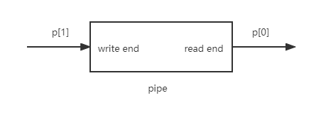
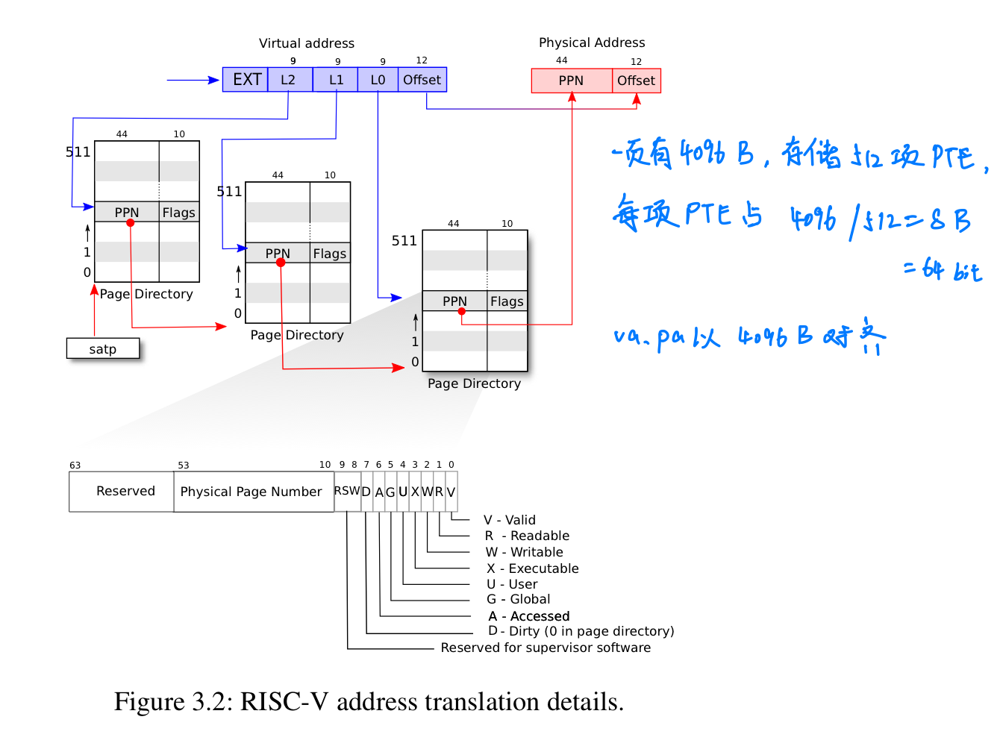

<!-- @import "[TOC]" {cmd="toc" depthFrom=1 depthTo=6 orderedList=false} -->

<!-- code_chunk_output -->

- [简介](#简介)
- [xv6-book](#xv6-book)
  - [chapter1 Operating system interfaces](#chapter1-operating-system-interfaces)
  - [chapter2 Operating system organization](#chapter2-operating-system-organization)
    - [Code:starting xv6, the first process and system call](#codestarting-xv6-the-first-process-and-system-call)
  - [chapter3 Page tables](#chapter3-page-tables)
    - [Code：create an address space](#codecreate-an-address-space)
    - [Code：Physical memory allocator](#codephysical-memory-allocator)
    - [Code：sbrk](#codesbrk)
    - [Code：exec](#codeexec)
  - [Chapter4 Traps and system calls](#chapter4-traps-and-system-calls)
    - [Code：Calling system calls](#codecalling-system-calls)
    - [Code：System call arguments](#codesystem-call-arguments)
- [lec](#lec)
  - [lec4](#lec4)
- [lab](#lab)
  - [lab guidance](#lab-guidance)
  - [Lab 1: Xv6 and Unix utilities](#lab-1-xv6-and-unix-utilities)
    - [prime](#prime)
  - [Lab 2: system calls](#lab-2-system-calls)

<!-- /code_chunk_output -->


# 简介
----
- 环境：ubuntu20.04、qemu（模拟RISC-V64）、gdb-multiarch。
- 在RISC-V中，寄存器x0永远是0。
- 在xv6中，所有的用户都是root。
- 编译器可能会优化机器指令，所以要结合kernel.asm和函数对应的*.s文件。


# xv6-book
----

## chapter1 Operating system interfaces
- 当用户程序调用一个system call，硬件提高特权等级（privilege level），并运行内核中的一段预先安排的代码。
  >用户空间和内核空间的接口：system calls系统调用，`Look and behave like function calls, but they aren’t`。

- 内核为每个进程维护一个PID标识符

- `exec`system call会用调用的可执行文件（存储在文件系统中）覆盖进程的内存，但是会保留file table。`exec`不会返回，会从elf header中的entry开始执行。

- 每个进程都有用来存放fd的私有空间file table，fd从0开始。每个fd都有对应的offset，每次调用`read`或`write`都会从上一次地方开始。新分配的fd从最小的数字开始。

- pipe有2个接口：read和write，当write end和所有引用write end的fd关闭时，pipe才会关闭，这时候read读完缓冲区所有内容后下一次read返回0。pipe在内核中实现，有缓冲区。


- `mknod`创建特殊文件（称为device设备），需要传入2个数字用于唯一标识一个kernel device。当打开一个device file，内核会把`read`和`write`替换为kernel device implementation。

- 当一个文件的`link`为0且没有fd应用它时，释放文件的inode和磁盘空间。


## chapter2 Operating system organization
- os需要满足三个需求：multiplexing，isolation and interaction（pipe）。

- 对物理资源的抽象：进程、文件等。通过系统调用（ecall）从用户空间陷入内核空间（即从user mode转入supervisor mode）。

- riscv的三种模式：machine mode，supervisor（kernel） mode and user mode。supervisor mode下可以执行`privileged instructions`，比如使能/失能中断、读/写satp寄存器。
  >运行在内核空间（supervisor mode）的software/code称为kernel。

- 宏内核（monolithic kernel）和微内核（micro kernel）。微内核中，在用户空间像进程一样运行的os服务（如file server）成为servers。

- 进程的虚拟内存空间layout：

heap堆在需要时通过malloc分配空间。在虚拟地址空间最顶处分配了一页trampoline（包含进出内核的代码）和一页trapframe（save/restore用户进程的状态）。
  >硬件使用39位寻址va，但是xv6只使用了38位，避免对设置了高位的va进行符号拓展。所以最大地址`MAXVA`（kernel/riscv.h:363）= 2^38-1 = 0x3fffffffff。

- 内核为每个进程维护一个结构体`proc`（kernel/proc.h:86），保存进程状态，如p->state和p->pagetable。

- 每个进程有两个栈：user stack和kernel stack，分别在用户空间和内核空间下使用。`ecall`指令进入内核空间，`sret`指令返回用户空间。

- xv6中，一个进程包含一个线程和一个地址空间。

- security：os必须假设进程的user-level代码会尽最大的可能去破坏内核或其他进程。在内核中可能存在bugs的地方设计safeguards，如：assertions、type checking和stack guard pages。

### Code:starting xv6, the first process and system call
1. powers on：初始化，运行存储在read-only memory中的boot loader。boot loader会把xv6 kernel下载到内存中（0x80000000）。然后xv6以machine mode运行`_entry`（kernel/entry.S:7）。

2. entry.S：初始化栈使xv6可以运行C代码，然后跳转进入`start()`（kernel/start.c:21）。

3. start.c：进行一些只能在machine mode运行的初始化并转到supervisor mode。比如：失能内存地址映射（往satp寄存器写0）、编程时钟芯片来初始化定时器中断。通过`mret`指令返回supervisor mode，这将导致pc寄存器指向`main()`（kernel/main.c:11）。

4. main.c：初始化一些设备和子系统后，运行`userinit()`（kernel/proc.c:226）即创建第一个进程等待scheduler调度，里面嵌入了`initcode.S`（user/initcode.S:3）的RISC-V汇编代码，作用是将`exec`需要的参数加载到寄存器`a0`（="/init\0"）和`a1`（=argv）中并把系统调用编号加载到寄存器`a7`中。最后调用`ecall`重新进入内核执行系统调用`exec`运行`/init`（user/init.c:15）。
    >kernel在`syscall`（kernel/syscall.c:133）中使用寄存器`a7`中的数字执行对应系统调用。
    系统调用表（kernel/syscall.c:108）把`SYS_EXEC`映射为`sys_exec`。
    在`proc.c`中的`uchar initcode[]`就是`initcode.S`的十六进制代码。


## chapter3 Page tables
- satp寄存器
CPU中的satp寄存器保存root page table的地址，页表存在内存中的某个位置。MMU根据satp查找页表，MMU不负责建立页表，而是os负责。如果需要的物理地址（PM）不在页表中，MMU引发page-fault exception，由os负责从磁盘中寻找需要的page并移动到物理内存中。

- page table entry

  在Sv39 RISC-V中，只使用了39bits用于地址映射（共512GB），高位25bits用于未来拓展。在39bit中，前27bit用于三级页表，后12bit为物理内存offset，用于索引一页`4096(2^12)bytes`中的偏移。每级页表有512项，索引下一级页表时，offset全为0。
  为了避免从物理内存移动PTEs的代价，RSIC-V CPU使用TLB(Translation Look-aside Buffer)用于缓存PTEs。
  >如果只使用一级页表，需要2^27表项，需要占用很大的空间。
  如果一个进程用不到全部页表，多余的页表项（第2、3级页表）不会分配空间。

- 物理内存指的是DRAM中的存储单元，ma的每个字节都有一个地址，称为物理地址。os初始化开启地址映射后，指令使用的地址是虚拟地址。

- kernel address map

  xv6为每个进程维护一张pagetable，同时为内核维护一张kernel pagetable（直接映射）。

  有2个地址没有直接映射：
  1. trampoline page：映射2次，1次高地址，1次直接映射。
  2. kernel stack page：每个进程都有自己的kstack，伴随一页guard page。guard page不会在物理地址中映射空间，栈溢出直接导致page-fault。
  >如果kstack采用直接映射方式，guard page对应的物理地址将很难使用。 

### Code：create an address space
在`main()`（kernel/main.c）中初始化地址映射。

1. kinit()：擦除从end到PHYSTOP的物理内存，并在每个free page开头写入struct run，指向kmem.freelist，即指向下一页free page。

2. kvminit()：创建PTE和proc stack，核心函数为`mappages`和`walk`。`walk`用于寻找或创建pte。创建了`NPROC`（最多进程数）个proc stack（大小为一页）。
    >PA2PTE：先右移12位清除offset，再左移10位为Flags预留位置。
    PTE2PA：先右移10位清除Flags，再左移12位为offset预留位置。

3. kvminithart()：kernal pagetable写入satp
寄存器并enable paging。

4. 当改变页表时，需要invalid目前缓存的TLB entries，指令`sfence.vma`会flush目前CPU的TLB。xv6在kvminithart()中加载satp寄存器和在trampoline code（切换用户页表before返回用户空间）中执行`sfence.vma`。

### Code：Physical memory allocator
- 每个free page除了`struct run`之外不存储任何其他内容。freelist被一个`spin lock`保护，list和lock放在一个结构体中（`kmem`）。

- kinit()中初始化allocator，即初始化从`end of kernel`到`PHYSTOP`的物理内存到freelist。一个PTE只能对应以4096字节对齐的一段物理内存，所以初始化页表时传入的va和pa都是以4096字节对齐。

### Code：sbrk
- xv6使用系统调用`sbrk`来缩小或增长进程内存，通过函数`growproc`（kernel/proc.c:253）调用`uvmalloc`和`uvmdealloc`。`uvmalloc`（kernel/vm.c:221）调用`kalloc`分配物理内存和`mappages`添加PTEs到用户页表。`uvmdealloc`（kernel/vm.c:166）调用`uvmunmap`（调用`walk`查找PTEs）和`kfree`释放物理内存。

### Code：exec
`exec`系统调用使用文件系统里的一个`elf`文件（kernel/elf.h）来初始化一个地址空间的用户部分。

1. namei：根据`path`获取文件inode，每个文件都由唯一的inode标识。

2. readi：读取文件，判断是否为`elf`文件。

3. proc_pagetable：创建一张用户页表（没有user memory，有trampoline pages）。

4. 调用`uvmalloc`（kernel/exec.c:52）为每个elf段分配内存，调用`loadseg`（kernel/exec.c:10）加载每个段到内存中（使用`walkaddr`查找要分配的pa）。


## Chapter4 Traps and system calls
- 当发生`system call`,`exception`,`interrupt`时（统称为`trap`陷阱）CPU暂停当前指令，并转到解决上述事件的特殊代码中。内核可以只通过`a single code path`来解决所有的代码路径，然后判断三种情况执行对应代码（`handler`）。第一条`handler`指令通常是汇编，称为`vector`。

- Traps from user space：`trampoline`（kernel/trampoline.S:16）被映射到用户页表和内核页表的相同位置（va最高处），当发生陷阱时，进程以`supervisor mode`运行`trampoline`(此时仍然是用户页表)。并执行`uservec`（kernel/trampoline.S:16）,`usertrap`（kernel/trap.c:37）,`usertrapret`（kernel/trap.c:90）,`userret`（kernel/trampoline.S:88）。
  1. save the user registers in TRAPFRAME。

### Code：Calling system calls
- `initcode.S`将`exec`系统调用的参数加载到寄存器`a0`（"/init\0"）和`a1`（=argv），将系统调用编号加载到寄存器`a7`（=7，`sys_exec`）。`ecall`指令陷入内核并执行`uservec`、`usertrap`、`syscall`。`syscall`使用`a7`的编号执行对应`sys_*`。

- 当`sys_exec`返回时，`syscall`会保存返回值到`p->trapframe->a0`，这是`exec()`的返回值。RISC-V中C语言函数返回值放在寄存器`a0`，系统调用返回负数表示error，返回0或正数表示success。
  >[Lab 2: system calls](#lab-2-system-calls)

### Code：System call arguments


# lec
----

## lec4
- 在MMU之前有对VM的cache，之后有对PM的cache。切换页表之后会flush TLB。多核CPU每核都有satp和TLB。

- 物理内存地址layout由硬件决定，所以开机boot结束后，跳转到`0x8000 0000`也是由硬件决定（该地址需要人为写到boot中用于跳转）。

- 卸载IO devices映射位置的指令，实际上是写到对应设备芯片或controller里。

- 物理地址里可能有一部分（高地址空间）unused，取决于板子上的DRAM大小和xv6限制（128MB）。


# lab
----

## lab guidance
- 难度：Easy（小于1h），Moderate（1-2h），Hard（>2h，不需要很多代码，但是需要一些技巧）。

- print

- gdb调试：在一个终端开启gdb server`make qemu-gdb`，在另一个终端开启gdb client`gdb or riscv64-linux-gnu-gdb`（ubuntu使用`gdb-multiarch`），会根据xv6-riscv/.gdbinit自动配置）。
    >如果出现类似下面的警告：
    `warning: File "<your path>/xv6-riscv/.gdbinit" auto-loading has been declined by your 'auto-load safe-path' set to "$debugdir:$datadir/auto-load".
    To enable execution of this file add
        add-auto-load-safe-path <your path>/xv6-riscv/.gdbinit
    line to your configuration file "~/.gdbinit".`
    按照提示做，在~/.gdbinit文件里添加`add-auto-load-safe-path <your path>/xv6-riscv/.gdbinit`。

- 查看`kernel.asm`，同时编译器编译内核后，会给每个user program生成对应的.asm。

- 内核崩溃时，报错信息里有pc寄存器的值，然后查看`kernel.asm`在哪个函数出错，或者运行`addr2line -e kernel/kernel pc-value`。

- `ctrl-a c`进入qemu的monitor，可以查看虚拟机的信息。`info mem`查看页表（使用`cpu`指令选择`info mem`查看哪个核，`make qemu CPUS=1`模拟单核）。

- gdb中输入layout split上下分层显示。

- xv6中的系统调用以`sys_`开头，源码在`kernel/sysproc.c`。`kernel/syscall.h`定义了系统调用编号，`kernel/syscall.c:108`转为宏定义`SYS_*`


## Lab 1: Xv6 and Unix utilities
- `ctrl + a x`退出qemu，xv6没有ps命令，但是可以输入`ctrl + p`，内核会输出每个进程的信息。


### prime
- 并发模型：
  1. 基于共享内存和锁的并发模型：在单核时代，基本使用这种方法。但是在多核和分布式情况下，可能并不适用。
  2. csp模型：通过通信来共享内存。

- 任务：使用pipes编写素数筛的并发版本。使用pipe和fork建立pipeline，父进程投喂2-35进入pipeline。对于每个素数，安排一个进程通过pipe从left neighbor进程读取，然后通过另一个pipe写入right neighbor进程。

- 提示：
  1. 关闭不需要的fd，否则在到达35之前会耗尽xv6的资源。
  2. 父进程投喂完后需要等待pipeline完成，
  3. 当write end of pipe关闭时，read读完pipe中所有数据后下一次read会返回0。
  4. 当需要时才在pipeline中创建子进程。

- xv6资源有限，不能一次创建11个pipe，所以在循环里关闭不需要的管道再创建新的管道
    ```c
    int p[11][2];
    int data_p,data_n;
    
    pipe(p[0]); pipe(p[1]);
    for( int i=2; i<36; i++ )// feed
        write(p[0][1], &i, 4);

    for( int i=0; i<11; i++ ){
        if( fork() == 0 ){ // parent
            close unuse pipe
            print prime and sieve
            close used pipe
        }
        else{ //parent
            close unuse pipe
            create new pipe for next child
        }
    }
    ```


## Lab 2: system calls
- 调用syscall时，内核执行`usys.S`对应的汇编，把`SYS_*`系统调用编号加载到寄存器`a7`然后执行`ecall`。`ecall`指令里会调用`syscall`（kernel/syscall.c:135），根据系统调用编号执行对应`sys_*`函数（调用`fork`等syscall时实际在执行`sys_*`）。在`sys_*`里执行对应功能或调用对应`*`函数。

- 