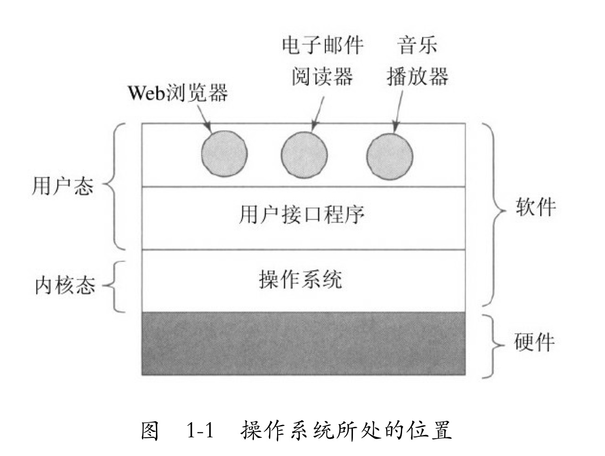
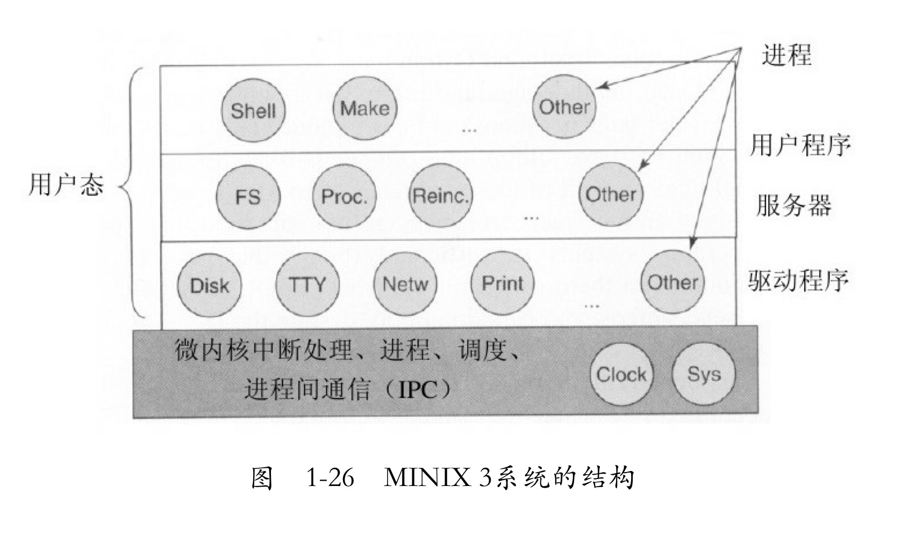

<!-- @import "[TOC]" {cmd="toc" depthFrom=1 depthTo=6 orderedList=false} -->

<!-- code_chunk_output -->

- [Chapter 1: 引论](#chapter-1-引论)
  - [1.1 什么是操作系统](#11-什么是操作系统)
  - [1.3 计算机硬件介绍](#13-计算机硬件介绍)
  - [1.4 操作系统大观园](#14-操作系统大观园)
  - [1.5 操作系统概念](#15-操作系统概念)
  - [1.6 系统调用](#16-系统调用)
  - [1.7 操作系统结构](#17-操作系统结构)
  - [1.10 本书其他部分概要](#110-本书其他部分概要)
- [Chapter 2: 进程与线程](#chapter-2-进程与线程)

<!-- /code_chunk_output -->

# Chapter 1: 引论
----
- os运行在内核态，拥有所有硬件的访问权，可以执行所有机器指令。在用户态运行的程序禁止执行会影响机器的控制或可进行I/O操作的指令。
  一些在用户态运行的程序也有争议地被认为是os的一部分。

## 1.1 什么是操作系统
- 多路复用共享资源：时间复用（进程切换等）和空间复用（内存中存放多个进程）。

## 1.3 计算机硬件介绍
- 计算机使用陷阱而不是一条指令来执行系统调用。

## 1.4 操作系统大观园
1. 大型机操作系统：批处理、事务处理和分时处理。

2. 服务器os

3. 多处理器os

4. 个人计算机os

5. 掌上计算机os

6. 嵌入式os

7. 传感器节点os

8. 实时os

9. 智能卡os

## 1.5 操作系统概念
- 一个（挂起的）的进程包括：进程的地址空间，对应的进程表项（其中包括寄存器以及稍后重启动该进程需要的许多其他信息）。

- 特殊文件：通常保存在/dev下，有块特殊文件（block special file）和字符特殊文件（character special file）。

## 1.6 系统调用
- 在UNIX中，的进程将其存储空间划分为三段：正文段（如程序代码）、数据段（如变量）和堆栈段。数据段向上增长而堆栈向下增长。

- 在UNIX中，每个文件都有唯一的i-编号用以标识文件，该编号是对i-节点表格的一个引用，它们一一对应，说明该文件的拥有者，磁盘块的位置等。一个目录就是包含了（i-编号，ASCII名称）对集合的一个文件。

- Windows中没有类似UNIX中的进程层次，所以不存在父进程和子进程的概念。在进程被创建之后，创建者和被创建者是平等的。

## 1.7 操作系统结构
1. 单体系统

2. 层次性系统

3. 微内核：某个服务的崩溃不会影响内核崩溃。在实时、工业、航空以及军事应用中特别流行，这些领域都是关键任务，需要高度的可靠性。如Integrity,K42,L4,PikeOS,QNX,Symbian,MINIX3。

4. 客户机-服务器模式

5. 虚拟机

6. 外核

## 1.10 本书其他部分概要
- 进程、存储管理、I/O管理、文件管理、安全。

# Chapter 2: 进程与线程
----
