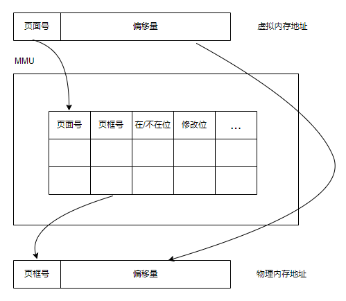

<!-- @import "[TOC]" {cmd="toc" depthFrom=1 depthTo=6 orderedList=false} -->

<!-- code_chunk_output -->

- [第二章 进程](#第二章-进程)
  - [进程](#进程)
  - [线程](#线程)
  - [进程间通信（inter process communication,ipc）](#进程间通信inter-process-communicationipc)
- [第三章 内存管理](#第三章-内存管理)

<!-- /code_chunk_output -->

## 第二章 进程
----

### 进程
- 进程内存：包括正在执行程序的机器代码、操作系统需要的一些信息（寄存器、PC程序计数器）、用来管理过程调用和返回的运行时栈、用户分配的内存块（比如用malloc库函数分配）等。
  守护进程（daemon）/后台进程：当请求到来是被唤醒。

- 并发：在一个CPU上的进程调度，看起来像是同时运行多个进程。
  并行：每个CPU上都有进程运行。

- Unix中子进程的初始地址空间是父进程的一个副本，但是是2个不同的地址空间。
  Win中一开始的父进程和子进程的地址空间就是不一样的。

- 内核维护进程表，进程的3种状态：运行态、就绪态、阻塞态。

- 中断后的调度：
    1. 硬件把程序计数器等压入堆栈。
    2. 硬件从中断向量装入新的程序计数器。
    3. 汇编语言过程保存寄存器的值。
    4. 汇编语言过程设置新的堆栈。
    5. C中断服务例程运行（典型地读和缓冲输入）
    6. 调度过程决定下一个将运行的进程。
    7. C过程返回至汇编代码。
    8. 汇编语言过程开始运行新的当前进程。

### 线程
- 线程共享地址空间、公共内存和其他资源。线程之间没有保护。
    |  线程共享内容   | 每个线程自己的内容  |
    |  ----  | ----  |

- 线程的2种实现方式：用户空间中（由运行时系统）、内核中维护线程表。前者比后者快，因为后者需要陷入内核（系统调用同样需要陷入内核）。线程同样有运行、就绪、阻塞、终止态。
  > 在用户空间中实现的线程进行阻塞系统调用会出现问题：中断并陷入内核，完成系统调用后返回。由于内核并不知道线程的存在，所以内核可能会切换到另一个进程，虽然此时该进程的时间片并没有用完。
  $\Longrightarrow$ 混合实现方式：调度程序激活机制（上行调用）。

- （早期的线程库）无法让时钟中断强制让线程让出CPU，所以线程要主动交出CPU。如今非抢占线程已经十分少见。

> 可重入过程：当过程调用没有结束时，可以进行第二次调用。

### 进程间通信（inter process communication,ipc）
- 

## 第三章 内存管理
----

程序直接使用物理地址（绝对地址）是危险的，可能会破坏操作系统或其他程序，所以多任务很难实现。

$\Longrightarrow$ 引入地址空间，每个程序有自己的空间：
1. 基址和界限寄存器：每条指令执行前都加上基址，然后判断是否超过界限。

2. 交换：切换任务时交换内存和ROM中的内容。速度慢。

3. 虚拟内存：每个进程都有自己独立的虚拟地址空间，需要MMU（Memory Management Unit）内存管理单元（内含一个页表），把虚拟内存地址映射为物理内存地址。（进程大小可能超过物理内存大小，或为了实现多任务，每个进程只能占有一部分物理内存）。

    缺页中断（page fault）时会陷入内核，由操作系统寻找对应的磁盘地址。`os如何做到？`

