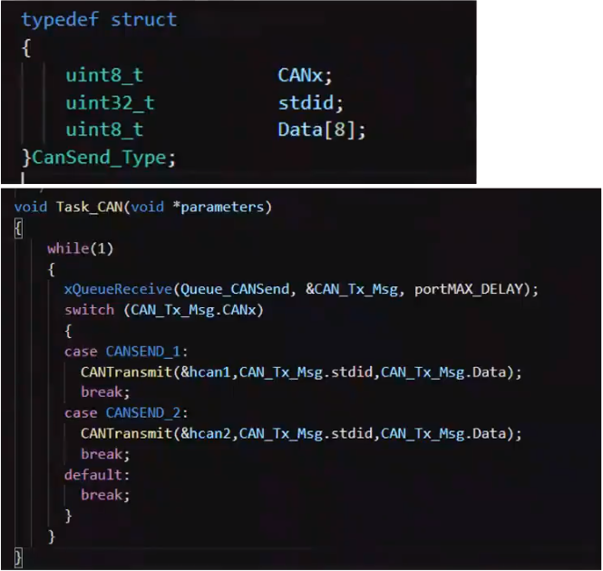
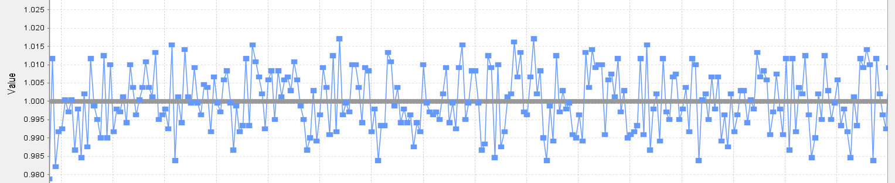
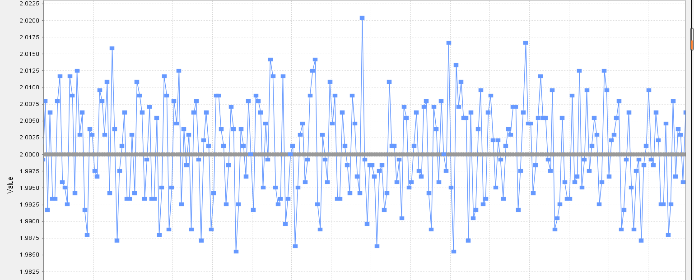
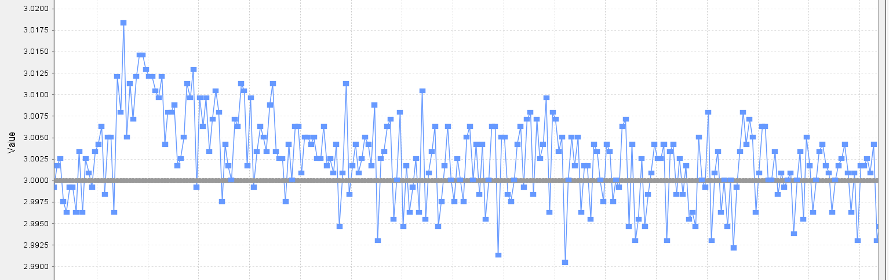

[toc]

# todo
----
1. 如果工程电机太多，一个电池无法供电，需要用裁判系统输出端口作为继电器信号，控制多个电池。

2. 保存珍贵的实战比赛第一视角视频


# issue
----
1. 平衡步兵视觉


# CAN
----
1. [C620调整终端电阻](https://bbs.robomaster.com/thread-12094-1-1.html)

2. [示波器看CAN终端电阻的作用](https://zhuanlan.zhihu.com/p/26096996)

3. [RM没必要使用CANopen](https://bbs.robomaster.com/forum.php?mod=viewthread&tid=7367)：CANopen也是在CAN2.0基础上，将11位的标识符重新定义了一下，然后定义了几个通信对象（PDO,SDO,NMT），然后还有对象字典可以存储设备的很多信息，主站可以读写设备的一些信息。如果有好多设备，分布式系统，对实时性要求不是很高，可以采用CANopen。RM的话，其实没有那么多设备，也不需要对象字典来存储那么多信息，另外生产CANopen的厂家都必须向CiA协会申请唯一的厂商代码，其他应该也要服从协会的一些规定，对于自己开发的话可能用不太到。其实自己开发的话，完全可以在CAN的11位标识符很和8字节的数据上做文章，设计自己的应用层协议。

4. [CANOpen系列教程](https://www.strongerhuang.com/CANOpen/CANOpen%E7%B3%BB%E5%88%97%E6%95%99%E7%A8%8B.html)

5. CANopen轻松入门周立功


# 论坛开源资料
----
[论坛开源汇总](https://bbs.robomaster.com/forum.php?mod=viewthread&tid=6979&extra=page%3D1)

## RM2021高校课程沙龙-江苏05-嵌入式经验分享(东南大学)
[视频链接](https://docs.qq.com/sheet/DUFlaU0FHZk1QS0l1?tab=cx5q1v)

1. FreeRTOS各任务之间尽量互不干扰，便于单独调试。正常情况下不允许有任务阻塞其他进程。创建一个LED BLINK任务，优先级最低，便于观察程序跑飞。

2. 任务调度可以使用systemview进行分析。

3. 对于一些要求精确时间的任务（比如PID控制任务要有精确的周期），尽量设置较高的优先级。

4. 全队代码框架和命名规范一致，便于代码复用和各车组间合作。

5. 为避免多个任务同时调用can发送数据包，存在冲突而发送失败的情况，可以建立一个can发送队列。


6. 超级电容：不能用裁判系统的功率数据进行超级电容的闭环控制。可以用simulink调试电路pid，不建议调试电机pid（建模难度大）。

7. 稳定性：
    - 不放过调试过程中的任何小问题，比如焊线，焊线不稳一定要重焊。
    - 和机械组沟通好布线问题
    - 尽量采用简洁的方案，更少的传感器。

8. 培训经验：注释认真写。


## RM圆桌第九期-PID控制深透析
[链接](https://bbs.robomaster.com/thread-8106-1-1.html)

1. 串级PID内环计算频率≥外环计算频率，在RM中=即可。

2. 只用PI控制即可，没必要增加高频相应。
>现实系统都有低通特性，没有特殊或严格要求没必要加微分项。

3. 云台俯仰时底盘陀螺仪测的数据不是云台的实际角速度数据，而是云台实际角速度数据的分量。所以数据需要相应的旋转，或在云台上放个陀螺仪测云台相对于地面的绝对角度，底盘旋转不会影响云台PID。

4. 陀螺仪尽量安装在车子中轴线，远离震动源。MEMS陀螺仪会收到加速度干扰。


## 强队电控开源代码
1. 华南虎
    - [2021英雄](https://bbs.robomaster.com/forum.php?mod=viewthread&tid=12215)
    - [2021舵轮步兵](https://bbs.robomaster.com/forum.php?mod=viewthread&tid=12207)

2. 深大
    - [2021英雄](https://bbs.robomaster.com/forum.php?mod=viewthread&tid=12319)
    - [2021双云台哨兵](https://bbs.robomaster.com/forum.php?mod=viewthread&tid=12293)
    - [2021双枪舵轮步兵](https://bbs.robomaster.com/forum.php?mod=viewthread&tid=12265)
    - [2021麦轮步兵电控](https://bbs.robomaster.com/forum.php?mod=viewthread&tid=12262)

3. 浙大
    - [2021哨兵全套](https://bbs.robomaster.com/forum.php?mod=viewthread&tid=6932) 电控代码丢失

4. 杭电
    - [2021麦轮、舵轮、全向轮底盘解算](https://bbs.robomaster.com/forum.php?mod=viewthread&tid=17629)

5. 西北工业大学
    - [2021步兵电控](https://bbs.robomaster.com/forum.php?mod=viewthread&tid=12255)

6. 东北大学
    - [2021双枪步兵电控](https://bbs.robomaster.com/forum.php?mod=viewthread&tid=12290)


## 电控小知识之电控视觉联调
[电控小知识之电控视觉联调](https://www.bilibili.com/video/BV1T5411K7nP/?spm_id_from=333.999.0.0&vd_source=b037d71dfcc90a4fe87a5c511ca50806)
1. 机械在sw设计的时候，要和电控视觉讨论布线，主要是电控。

2. 子弹出膛瞬间动量变化导致云台pitch轴角度发生变化的问题，如果通过机械上保证子弹初速度矢量与pitch轴转轴重合的话，感觉会比追求抗扰性能更好的控制算法更有效些。

3. 调通信的时候可以单独拿一块板来调 

4. 调视觉识别最好电控和视觉都在，在用pc（不是车上的视觉主机）调的时候准备一条比较长的线（比如2m），防止疯车的时候扯断线。

5. 布完线后让老队员检查一遍。


# 姿态解算（融合）
----

## 官方3508速度环PID分析(空载)

超调量：< 2%


超调量：< 1% 


超调量：< 0.5%，但是上方的点过多

- 不要一昧的增加P，当下方的点过多时存在静差，增加I。

### 电机编码器计算角度
```c
static fp32 motor_ecd_to_angle_change(uint16_t ecd, uint16_t offset_ecd)
{
    int32_t relative_ecd = ecd - offset_ecd;
    //过零检测
    if (relative_ecd > HALF_ECD_RANGE)
    {
        relative_ecd -= ECD_RANGE; 
    }
    else if (relative_ecd < -HALF_ECD_RANGE)
    {
        relative_ecd += ECD_RANGE;
    }

    return relative_ecd * MOTOR_ECD_TO_RAD;
}
```
根据以上函数只能计算转子的角度（没有减速箱时机械转子角度就是输出轴角度，-180°~180°。6020没有减速箱，所以可以用这种方法计算编码器角度。如果电机有减速箱就不能得到输出轴的角度（3508减速比约为19:1）。
不管有没有减速箱该方法只解决了过零检测，当输出轴转过360°时不能累计角度。


## 双轴云台控制
[Robomaster电控入门（7）双轴云台控制](https://www.guyuehome.com/35019)
云台的参数调节除了和PID参数有关之外，还和控制周期，传感器反馈频率，器件热噪声大小等因素有关，有的时候其实不需要复杂的参数就能有很好的控制效果


## 过零检测
[RM电机过零检测](http://t.csdn.cn/lpQpp)


# 电控
----
1. 工程代码框架、命名规范和布线。暑假先重新阅读官方例程和开源代码，官方例程有一点臃肿。阅读完代码后再统一代码框架和命名规范等。可以先修改本赛季工程代码用于调试，但是后面要按照规定的代码框架重写。要有一套能够传承下去的代码框架。
代码框架要求：简洁、命名规范统一。

2. 代码版本管理：
    - 每个版本一个文件夹，文件夹附加版本信息，比如年月日
    - git


# 视觉
----
1. Robomaster——关于视觉组，你想要了解的都在这里
[Robomaster——关于视觉组，你想要了解的都在这里](http://t.csdn.cn/mhm56)

2. RoboMaster机甲大师——视觉组——总结、未来期望与比赛经验分享
[RoboMaster机甲大师——视觉组——总结、未来期望与比赛经验分享](http://t.csdn.cn/29nCT)

3. RoboMaster视觉教程——浙大
[RoboMaster视觉教程——浙大](http://t.csdn.cn/0Cym3)


# 双足轮腿机器人
----
1. ascento两轮机器人

2. SK8O两轮机器人