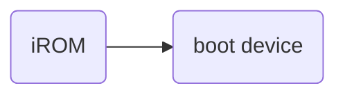

# uboot启动方式
因为nandflash没有地址总线，所以不能直接在nandflash中运行，
选择这种上电方式后会将nandflash前4k拷贝到RAM中。

norflash有地址总线，选择这种启动方式后，会将norfalsh映射到`0x0000 0000`，
cpu会在norflash上执行。

[uboot在nandflash和norflash是如何运行的](https://www.cnblogs.com/aaronLinux/p/5540606.html)

[u-boot分析1：Nandflash、Norflash启动](https://blog.csdn.net/qq_31917863/article/details/79863756)

[野火 IMX6ULL uboot启动流程](https://doc.embedfire.com/lubancat/build_and_deploy/zh/latest/building_image/boot_image_analyse/boot_image_analyse.html)

目前uboot也可以使用设备树的方式配置该阶段需要使用的驱动参数。

# IMX6ULL BOOT
参考`i.MX 6UltraLite Applications Processor Reference Manual` Chapter 8 System Boot

1. boot flow：

2. iROM/RAM memory map：

3. 部分boot device：
    - NOR Flash Boot Operation
    

    - Expansion Device Boot Operation
    

4. Image Vector Table and Boot Data

# 设备树
linux首先引入设备树，然后uboot引入。

aarch64一开始设备驱动和参数是写死的，但是不同的arm开发板有不同的硬件，会造成代码臃肿。
所以分离出来，通过设备树可以知道有哪些硬件，以及配置这些硬件的驱动需要的参数。

前提是需要在编译uboot和kernel前使能使用设备树的选项。

在x86上可以自动枚举PCIE总线上的设备。

[为什么linux在x86上不需要设备树，在aarch64上需要设备树？](https://www.zhihu.com/question/475730584/answer/2709878631)
